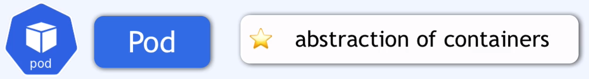

### pod

Pod jest warstwą abstrakcji na szczycie kontenerów.

Najmniejsza jednostka w k8s.
Abstrakcyjny kontener, nie jest kontenerem ale kontener jest na nim umieszczany.
Nie może być wiecej niż jeden kontener na podzie (ale są wyjątki).