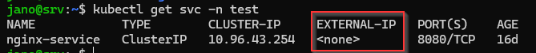
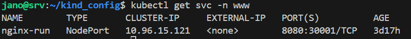
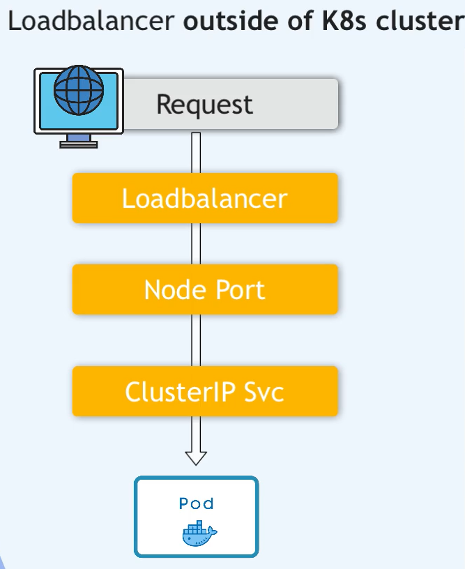
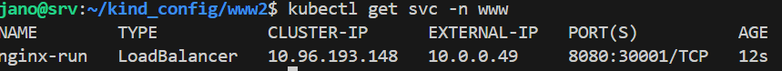
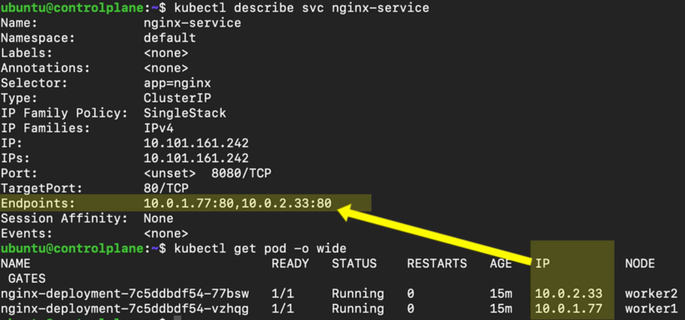
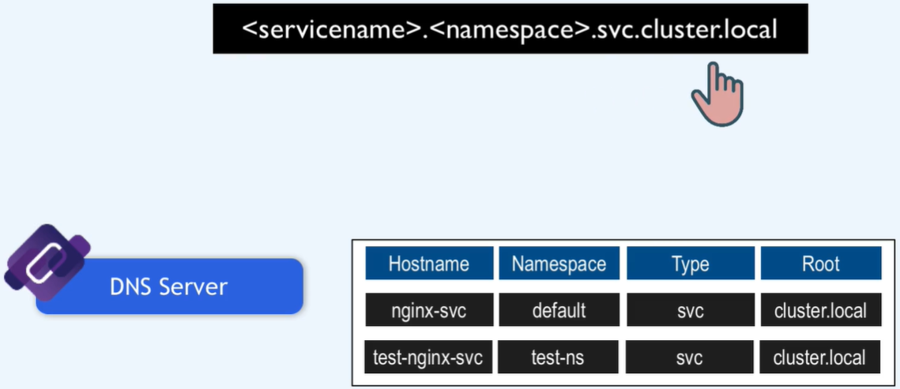

### svc


k8s dostercza virtual network

Każdy pod otrzymuje IP adres, który umożliwia komunikacje podów między sobą.

Pod jest krótkotrwały, jeśli zostanie usunięty to nowemu podowi zostanie przypisany nowy adres IP. Jest to problematyczne z tego względu, że pod na którym uruchomiona jest aplikacja, ma na stałe zapisane adres poda bazy danych, zmiana adresu doprowadzi do utraty połaczenia pomiędy podami co będzie skutkować brakiem funkcjonowania aplikacji.

Rozwiązanem tego problemu jest SERVICE, swoisty statyczny adresem IP przypisywany podom.

Jeśli pod zostanie usunięty/zrestartowany to nowy pod otrzyma nowy adres IP ale skomunikuje się z komponentem service, gdzie odnajdzie informacje o adresie IP zarezerwowanym dla niego.

sprawdź:

```bash
kubectl get service -n namespace
kubectl get svc -n namespace
kubectl describe pod -n namespace cochise-xxxxxxxxx-xxxxx |grep IP:
```

External Service - pozwala na dostęp do applikacji z zewnątrz klastrka k8s. Otwiera komunikację z zewnętrznych żródeł.

Internal Service - dla połaczeń, wewnąrz klastra.

Service jest także load ballancerem, przejmuje zapytanie od LB i przekazuje do poda który jest w tym czasie mniej zajęty, (o ile tylko apliakcja posiada wiece niż jeden pod).


Tworząc taką replikę muszę zdefiniować blueprint dla podów, w której wskazuje jak wiele replik poda ma istnieć  --> [deployment](../04-deployment/deployment.md)

## Cluster IP - internal service



Tworzenie svc:ClusterIP z lini poleceń
```bash
kubectl create service clusterip nginx-run \
--namespace www --tcp 8080:80 \
--dry-run=client -o yaml > $service_cip.yaml
```
pod jest dostepny przes inne pody w dany klastrze

```yaml
apiVersion: v1
kind: Service
metadata:
  creationTimestamp: null
  labels:
    app: nginx-run
  name: nginx-run
  namespace: www
spec:
  ports:
  - name: 8080-80
    port: 8080
    protocol: TCP
    targetPort: 80
  selector:
    app: nginx-run
  type: ClusterIP # jeśli nie ma linii dotyczącej typu serwiu to jest to ClusterIP (default)
status:
  loadBalancer: {}
```


## NodePort - external service
Dedykowany port na nodzie, dostępny dla danego servisu z zakresu 30000 - 32767



Tworzenie svc:NodePort z lini poleceń
```bash
kubectl create service nodeport nginx-run \
--namespace www --tcp 8080:80 --node-port=30001 \
--dry-run=client -o yaml > $service_np.yaml
```

Wystawia na zewnątrz usługę

nodePort: 30001 - Port, na którym usługa będzie dostępna na węzłach klastra, (port na nodzie).
port: 8080 - Port, na którym usługa będzie dostępna wewnętrznie w klastrze.
targetPort: 80 - Port, na który ruch będzie przekazywany, (port na podzie). 


```yaml
apiVersion: v1
kind: Service
metadata:
  creationTimestamp: null
  labels:
    app: nginx-run
  name: nginx-run
  namespace: www
spec:
  ports:
  - name: 8080-80
    nodePort: 30001  ### !!! ###
    port: 8080
    protocol: TCP
    targetPort: 80
  selector:
    app: nginx-run
  type: NodePort
status:
  loadBalancer: {}
```


## LoadBallancer

Teoretycznie po za typm nie różni się niczym innym od NodePort, ale w przypadku LB nadawany jest publiczny adres ip dla każdego SVC.
LB dziali ruch pomiędzy nody, na których deployment uruchomił pody (replikasets).
LB znajduje się po za klastrem k8s
W przypadku EKS, lub innego rozwiązania serverless, load ballancer tworzony jest automatycznie dla każdego servisu.
Gdy używasz klastra opartego o instanceje, to ty jesteś odpowiedzialny za utworzenia LB i przypisanie go do servisu.



Tworzeniud svc:LoaBallancer z lini poleceń
```bash
kubectl create service loadbalancer nginx-run  \
--namespace=www --tcp=8080:80  \
--dry-run=client -o yaml > $service_lb_yaml
```
Następne należy edytować plik ```$service_lb_yaml``` i dodac ```nodePort: 30000``` w ```.spec.ports[].```



```yaml
apiVersion: v1
kind: Service
metadata:
  creationTimestamp: null
  labels:
    app: nginx-run
  name: nginx-run
  namespace: www
spec:
  ports:
  - name: 8080-80
    port: 8080
    protocol: TCP
    targetPort: 80
    nodePort: 30001
  selector:
    app: nginx-run
  type: LoadBalancer
status:
  loadBalancer: {}
```

Jeśli utworzysz klastek k8s w swojej serwerowni, to ty jesteś odpowiedzialny za utworzenie LB (polecam metalLB). Jaśli klaster taki zostanie utworzony EKS, AKS, GKE; to usługodawca odpowiada za tworzenie LB (LB tworzony jest altomatycznie).
Liczba LB jest limitowana.

Nawet jeśli nie utworzysz LB to aplikacja będzie dostępna tak samo jak w przypadku NodePort ```http://<nod_public_ip>:port```

Wpisz pomendę poniżej, aby zweryfikować czmu twoja aplikacja nie ziała a anasępnie sprawdź jej dostępność z poziomu innego poda i z poziomu nowa używając polecenia ```kubectl exec```
```bash
kubectl describe service -n namespace
```

`Selector` - dla deployment (pod) i service musi być taki sam, inaczej aplikacja nie będzie widziana na zewnątrz.
type - są trzy typy (clusterip, loadballancer, nodePort)
port - port na jakim działą apliakacj a NODzie
targetPort - port na jakim działa aplikacja w PODzie
endpoint - musi być ten sam na podzie co na servisie (insaczej servisr nie odnosie się do komunikacji z tym deploymentem)

`kube-proxy` przechowue listę wszystkich serviców i odpowiada za korelację połączenia pod-node. Zarządza serwisami i endpointami.<br>
`kube-proxy`, to agent sieciowy uruchamiany na każdym nodzie, którego zadaniem jest implementacja abstrakcji Service na poziomie ruchu sieciowego (clusterIP, nodePort), realizuje routing i load balancing ruchu do Podów (osi - L4)

`Ingress` odpowiada za ruting ruchu (osi - L7)

przy toubleshoutingu sprawdź czy działąją wszystkie pody w `kube-system` a w szczególności `coredns`
```bash
kubectl get po -A -l k8s-app=kube-dns
```
Za każdym razem gdy tworzymy nowy:
- svc w kubernetes, DNS service dopisuje do swojej tabeli nazwę servisu oraz jego ip
- pod, kubelet informacje w podzie o adres servera dns (kube-dns) w plik `/etc/resolve.comf`
- service (svc), k8s udostępnia jego nazwę fqdn w postaci 
informacje o klastrze dns możesz sprawdzić na nodzie controlplain ``` cat /var/lib/kubelet/config.yaml```


```/etc/kubernetes/manifests/``` jest specjalnym miejscem w systemie, w którym Kubernetes przechowuje pliki manifestów YAML
- kube-apiserver.yaml: Definiuje konfigurację dla Kubernetes API Server. API Server zarządza komunikacją w klastrze i jest punktem wejściowym do API Kubernetes. Edytuj ten plik można w łatwt sposób już na utworzonym klastrze zminic CIDR dla servisów  (kubectl get svc)
  ```- --service-cluster-ip-range=10.96.0.0/12``` - default 
  aktuaizacja dotyczy tylko nowo utworzonych servisuó
- kube-controller-manager.yaml: Definiuje konfigurację dla Controller Managera, który zarządza kontrolerami odpowiedzialnymi za utrzymanie stanu klastrów.
- kube-scheduler.yaml: Konfiguracja dla Scheduler, który przydziela zasoby (np. pod) na odpowiednie węzły na podstawie dostępności i reguł.
- etcd.yaml (jeśli etcd jest zarządzany lokalnie): Konfiguracja dla etcd, który przechowuje dane stanu klastrów Kubernetes.