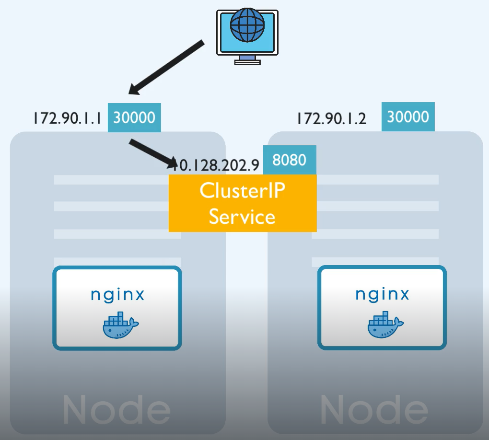

### svc


k8s dostercza virtual network

Każdy pod otrzymuje IP adres, który umożliwia komunikacje podów między sobą.

Pod jest krótkotrwały, jeśli zostanie usunięty to nowemu podowi zostanie przypisany nowy adres IP. Jest to problematyczne z tego względu, że pod na którym uruchomiona jest aplikacja, ma na stałe zapisane adres poda bazy danych, zmiana adresu doprowadzi do utraty połaczenia pomiędy podami co będzie skutkować brakiem funkcjonowania aplikacji.

Rozwiązanem tego problemu jest SERVICE, swoisty statyczny adresem IP przypisywany podom.

Jeśli pod zostanie usunięty/zrestartowany to nowy pod otrzyma nowy adres IP ale skomunikuje się z komponentem service, gdzie odnajdzie informacje o adresie IP zarezerwowanym dla niego.

sprawdź:

```bash
kubectl get service -n namespace
kubectl get svc -n namespace
kubectl describe pod -n namespace cochise-xxxxxxxxx-xxxxx |grep IP:
```

External Service - pozwala na dostęp do applikacji z zewnątrz klastrka k8s. Otwiera komunikację z zewnętrznych żródeł.

Internal Service - dla połaczeń, wewnąrz klastra.

Service jest także load ballancerem, przejmuje zapytanie od LB i przekazuje do poda który jest w tym czasie mniej zajęty, (o ile tylko apliakcja posiada wiece niż jeden pod).


Tworząc taką replikę muszę zdefiniować blueprint dla podów, w której wskazuje jak wiele replik poda ma istnieć  --> [deployment](../04-deployment/deployment.md)

## Cluster IP - internal service

Tworzenie svc z lini poleceń
```bash
kubectl create service clusterip nginx-run --namespace $namespace --tcp 8080:80 --dry-run=client -o yaml > $service_cip.yaml
```
pod jest dostepny przes inne pody w dany klastrze

```yaml
apiVersion: v1
kind: Service
metadata:
  creationTimestamp: null
  labels:
    app: nginx-run
  name: nginx-run
  namespace: www
spec:
  ports:
  - name: 8080-80
    port: 8080
    protocol: TCP
    targetPort: 80
  selector:
    app: nginx-run
  type: ClusterIP # jeśli w spec: nie ma typu svc to jest to ClusterIP (default)
status:
  loadBalancer: {}
```


## NodePort - external service

Tworzenie svc z lini poleceń
```bash
kubectl create service nodeport nginx-run --namespace www --tcp 8080:80 --node-port=30001  --dry-run=client -o yaml > $service_np.yaml
```

Wystawia na zewnątrz usługę

nodePort: 30001 - Port, na którym usługa będzie dostępna na węzłach klastra.
port: 8080 - Port, na którym usługa będzie dostępna wewnętrznie w klastrze.
targetPort: 80 - Port, na który ruch będzie przekazywany. 


```yaml
apiVersion: v1
kind: Service
metadata:
  creationTimestamp: null
  labels:
    app: nginx-run
  name: nginx-run
  namespace: www
spec:
  ports:
  - name: 8080-80
    nodePort: 30001  ### !!! ###
    port: 8080
    protocol: TCP
    targetPort: 80
  selector:
    app: nginx-run
  type: NodePort
status:
  loadBalancer: {}
```



## LoadBallancer

Teoretycznie po za typem nie różni się niczym innym, ale w przypadku LB nadawany jest publiczny adres ip dla każdego SVC.
LB dziali ruch pomiędzy nody, na których deployment uruchomił pody.


```yaml
apiVersion: v1
kind: Service
metadata:
  creationTimestamp: null
  labels:
    app: nginx-run
  name: nginx-run
  namespace: www
spec:
  ports:
  - name: 8080-80
    port: 8080
    protocol: TCP
    targetPort: 80
    nodePort: 30001
  selector:
    app: nginx-run
  type: LoadBalancer
status:
  loadBalancer: {}
```