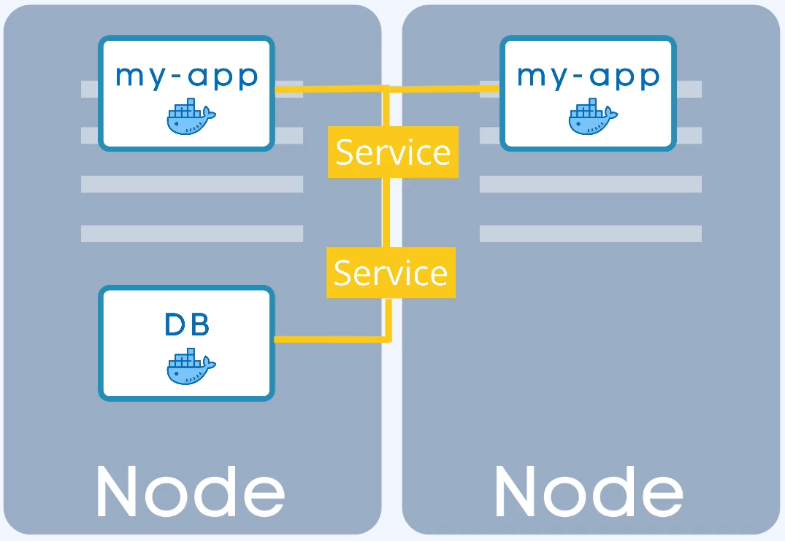

### svc


k8s dostercza virtual network

Każdy pod otrzymuje IP adres, który umożliwia komunikacje podów między sobą.

Pod jest krótkotrwały, jeśli zostanie usunięty to nowemu podowi zostanie przypisany nowy adres IP. Jest to problematyczne z tego względu, że pod na którym uruchomiona jest aplikacja, ma na stałe zapisane adres poda bazy danych, zmiana adresu doprowadzi do utraty połaczenia pomiędy podami co będzie skutkować brakiem funkcjonowania aplikacji.

Rozwiązanem tego problemu jest SERVICE, swoisty statyczny adresem IP przypisywany podom.

Jeśli pod zostanie usunięty/zrestartowany to nowy pod otrzyma nowy adres IP ale skomunikuje się z komponentem service, gdzie odnajdzie informacje o adresie IP zarezerwowanym dla niego.

sprawdź:

```bash
kubectl get service -n namespace`
kubectl describe pod -n namespace cochise-xxxxxxxxx-xxxxx |grep IP:`
```

External Service - pozwala na dostęp do applikacji z zewnątrz klastrka k8s. Otwiera komunikację z zewnętrznych żródeł.

Internal Service - dla połaczeń, wewnąrz klastra.

Service jest także load ballancerem, przejmuje zapytanie od LB i przekazuje do poda który jest w tym czasie mniej zajęty, (o ile tylko apliakcja posiada wiece niż jeden pod).



Tworząc taką replikę muszę zdefiniować blueprint dla podów, w której wskazuje jak wiele replik poda ma istnieć  --> [deployment](../04-deployment/deployment.md)