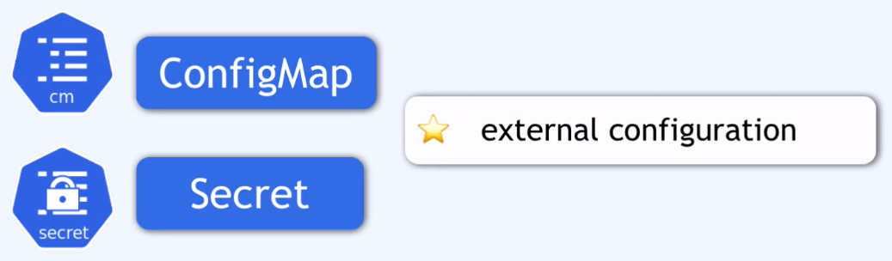

### cm

Zewętrzna konfiguracja aplikacji

Zazwyczaj zawiera dane konfigurecyjne jak url bazy danych, użytkownik, hasło lub innych serwisów których używasz.

Przehowywaie w ConfigMap dancy o uzytkowniku i haśle nie jest najlepszym pomysłem (plain text) --> patrz komponent secret.

Pod pobiera informacje z ConfigMap o wszystkich serwisach i połaczeniach z db.

Jeżeli trzeba zmienic bazę danych to wystarczy zmienić informacje o niej w ConfigMap, nie trzeba robić zman w repozytorium dla danej aplikacji a następnie pushować do k8s.
