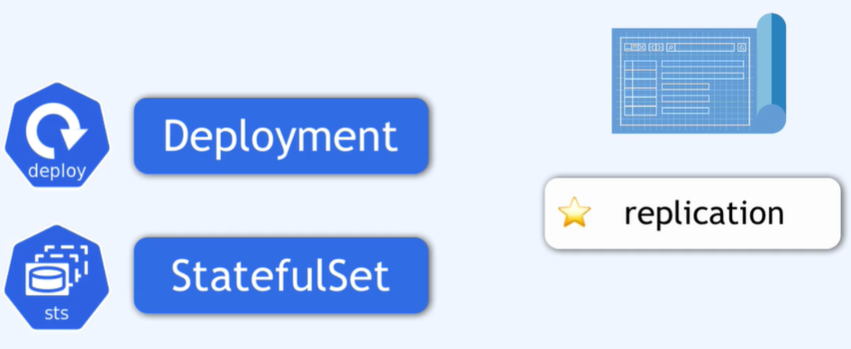
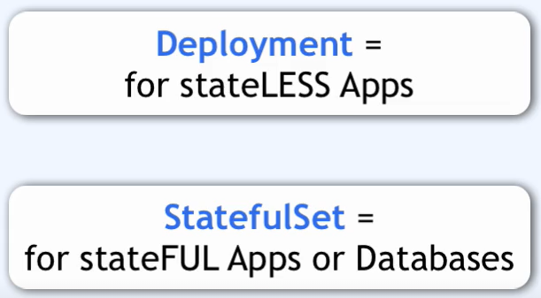

### deploy

Deployment jest warstwą abstrakcji na szczycie podów, wchodzi w interakcję z podem, jako replikacja konfiguracja poda.

Deployment to swego rodzaju plan (blueprint) dla podów "my-app".

Przechowuje informacje o replice danego poda.

Pody bazodanowe nie moga być replikowane podprzez deployment. (data base is state)

