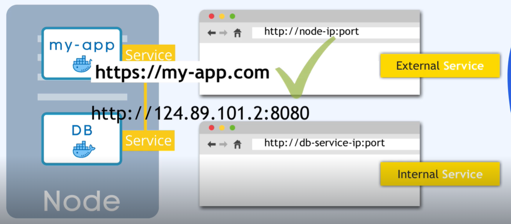

### ing




Można publikować aplikację podając adres noda, na którym znajduje się obecnie pod 'my-app' wraz z portem.
Przy czym jest to dobre rozwiązanie dla samego testowania palikacji.

```bash
kubectl describe pod -n namespace cochise-xxxxxxxxx-xxxxx |grep 'Node:\|Port:'`
```

```
Node:         ip-124-89-101-2.eu-west-3.compute.internal/124.89.101.2
Port:         8080/TCP
```

Dla publikowania aplikacji dla klienta, wymagany był by protoków https oraz nazwa domenowa i to jest zadanie dla ingress

Ingress -  forwarding dla service.
