### ing


zainstaluj menadżera pakietów k8s, którey ułatwi intalację nginx-ingress-controllera i nie tylko.

#### Instalacja Helm
URL: https://helm.sh/docs/intro/install/ (ubuntu)
```sh
curl https://baltocdn.com/helm/signing.asc | gpg --dearmor | sudo tee /usr/share/keyrings/helm.gpg > /dev/null
sudo apt-get install apt-transport-https --yes
echo "deb [arch=$(dpkg --print-architecture) signed-by=/usr/share/keyrings/helm.gpg] https://baltocdn.com/helm/stable/debian/ all main" | sudo tee /etc/apt/sources.list.d/helm-stable-debian.list
sudo apt-get update
sudo apt-get install helm
```

#### Instalacja Ingress Controller (nginx)
URL: https://github.com/kubernetes/ingress-nginx
URL: https://kubernetes.github.io/ingress-nginx/deploy/ 

```sh
helm upgrade --install ingress-nginx ingress-nginx \
  --repo https://kubernetes.github.io/ingress-nginx \
  --namespace ingress-nginx --create-namespace
```

#### Imperative commend (tworzenie ingress-role)
Plik ingres może zostać stworzon z użyciem CLI, ale wcześniej należy zainstalować ingress-controller, który umożliwi tworzenie plików i przekierowanie zapytń do wewnętrznych serwisów.

```bash
kubectl create ingress nginx-ingress \ 
--rule="elastic_load_ballancer/*=nginx-service:8080" --namespace=www \ 
--dry-run=client -o yaml > www-ing.yaml
```

Jeśli bedziesz miał problem z implementacja ingress związaniem z webhoook  :

1. sprawdź webhook
```
kubectl get validatingwebhookconfiguration
```
2. tymczasowo wyłacz webhook
```
kubectl delete validatingwebhookconfiguration ingress-nginx-admission
```
1. zaimplementuj zasób ingess
```
k apply -f my-ingress.yaml
```
4. włacz webhook
```
kubectl apply -f https://raw.githubusercontent.com/kubernetes/ingress-nginx/main/deploy/static/provider/cloud/deploy.yaml
```

Ingress Controller pełni kluczową rolę, zarządzając ruchem zewnętrznym i kierując go do zasobów wewnątrz klastra na podstawie konfiguracji Ingress. Ingress Controller działa jako „brama” dla aplikacji i usług w klastrze, umożliwiając dostęp z zewnątrz poprzez domeny, reguły routingu, zabezpieczenia (TLS), oraz inne funkcje, które można skonfigurować na poziomie zasobu Ingress.

Ingres wskazuje na servic, który z  kolei wslazuje na deployment (pod).
Servisy dla na które wskazuje ingress musze być typu ClusterIP

Ingress przekazuje zapytaia do ClusterIP. W takim razie wszystkie dane (nazwa serwisu i port) zawate w ClusterIP muszą się znaleźć w Ingress.


| Wiersz  | Opis            |
|---------|------------------|
| 7-18    | routing rules    |
| 9 | adres domeny (to co jest wpisywane w url). To powinien być entry point na zwnąrz klastra, bądź jeden z nodów, na którym zzlokalizowana jest aplikacja|  
| 13-16 | adres domen przekazywany jest do wewnętrzenego serwisu |
| 17-18 | to co wpisywane jest po domenie (np. http://my-app.com/-=jano=-)|
| 10 | nie ma to nic wspólnego, że aplikacja działającą na porcie 80. Odnosi się do nadchodzącego pytania, które zostaje przekazane do wewnętrznego serwisu |
|


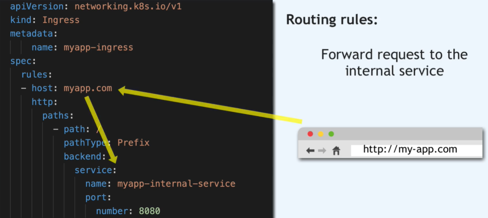

backend - jest targetem gdzie przychodzące pytanie jest przekierowywane do servisu wewnętrznego.

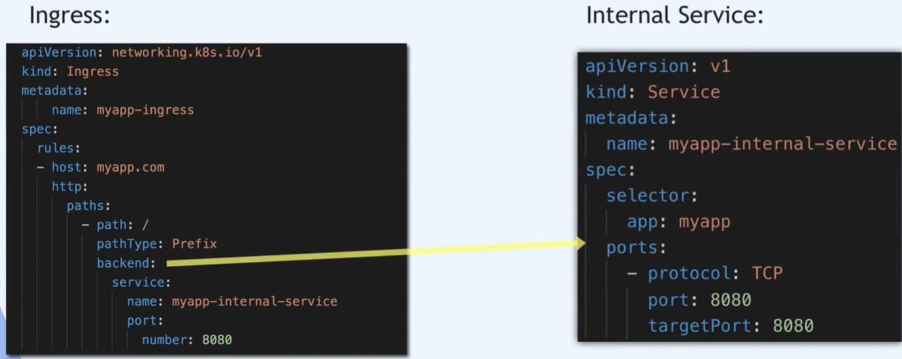

Ingres musi wiedzieć do jakiego serwisu ma przekierować zapytanie, wiec nazwa musi być tożsama z nazwa servisu wewnętrznego/

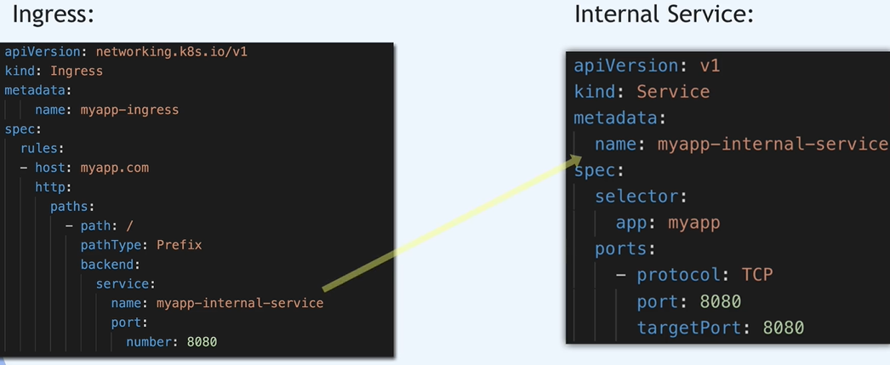

Numer portu powinien być numerem portu wewnęrznego serwisu
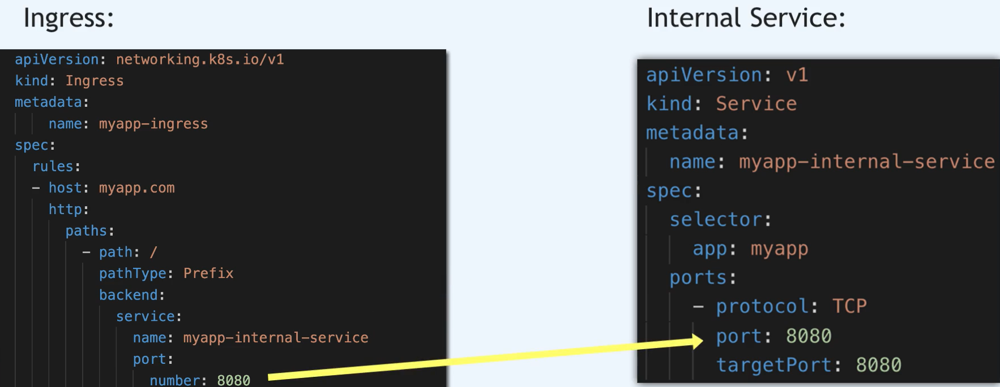

Można publikować aplikację podając adres noda, na którym znajduje się obecnie pod   ```my-app``` wraz z portem.
Przy czym jest to dobre rozwiązanie jedynie dla samego testowania palikacji.

```bash
kubectl describe pod -n namespace cochise-xxxxxxxxx-xxxxx |grep 'Node:\|Port:'`
```

```
Node:         ip-124-89-101-2.eu-west-3.compute.internal/124.89.101.2
Port:         8080/TCP
```

Dla publikowania aplikacji dla klienta, wymagany był by protoków https oraz nazwa domenowa i to jest zadanie dla ingress.

Ingress -  forwarding dla serwisów, pozwala na konfigurecję routingu dla każdego z servisu, umożliwia bezpieczne połaczenie do aplikacji (https)

## Multi paths
Czyli jedna domena ale wiele serwisów, które na niej dzialają. 

https://my-app.com/analytic
https://my-app.com/shopping

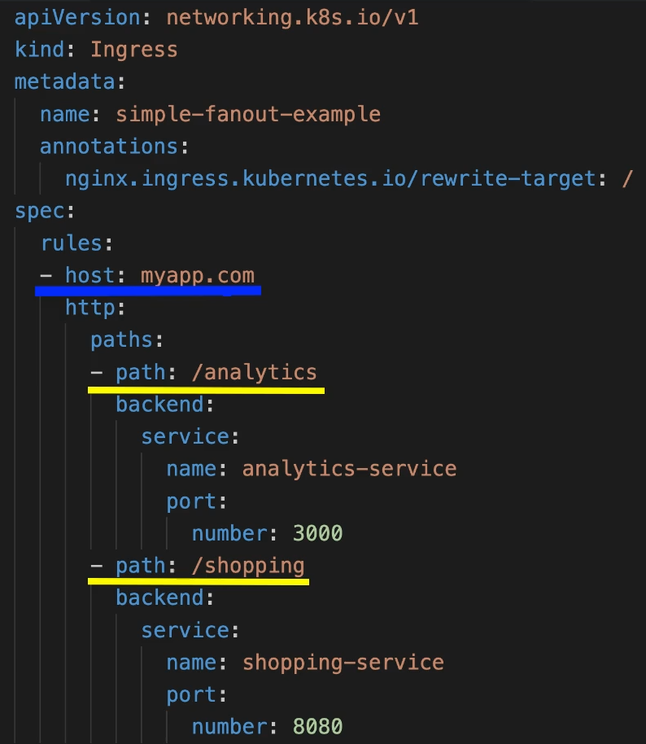

#### Sub-domain
https://analytic/my-app.com
https://shopping/my-app.com

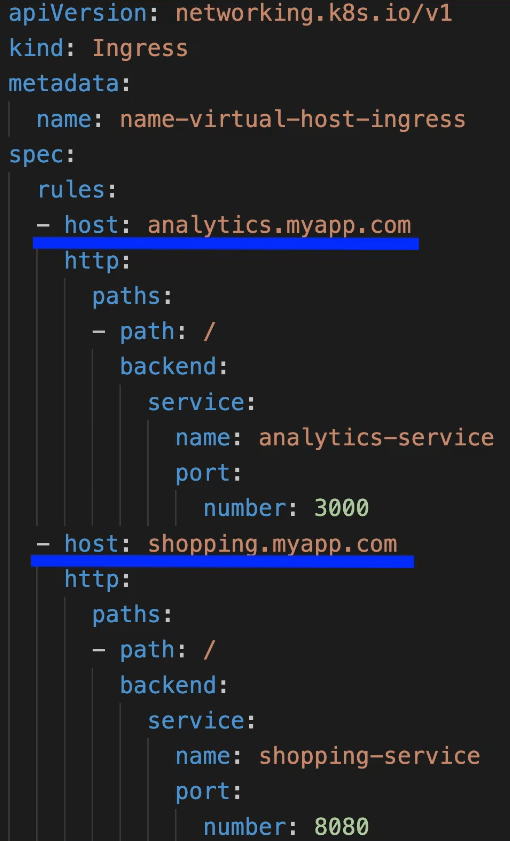

### TLS Certyfocate (https)

Do spec należ wstawić sekcje tls i utworzyć secret w którym kontent będzie zawierał tls.cert i tls.key, a type jest specyficznym kodem tls, namespace musi być takie same jak w ingres komponent. innymi słowy mówiąć, certyfilat wydawany jest na nazwę domeny (nie na adres IP)

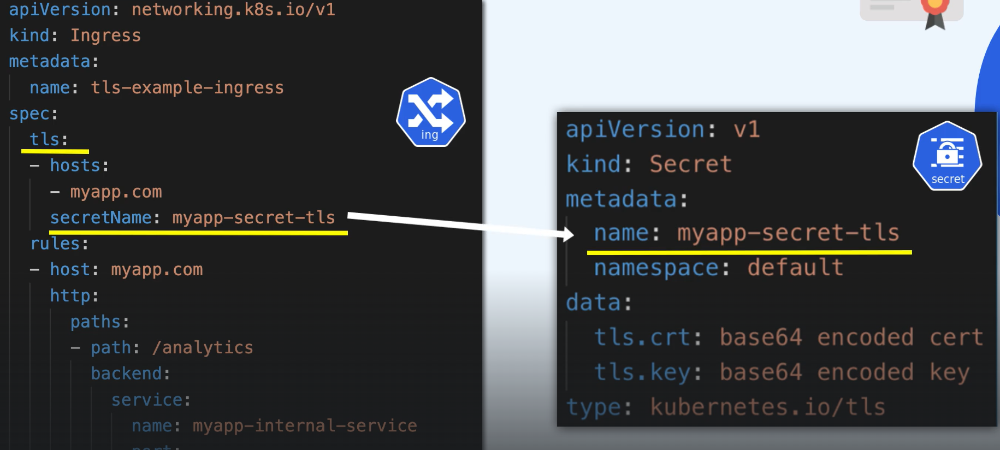

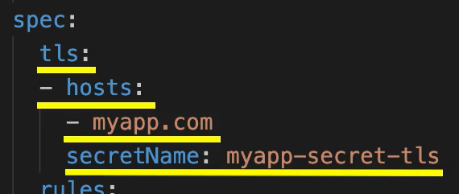

---
#### insrtalacja ingess-nginx

URL: https://github.com/kubernetes/ingress-nginx/blob/main/charts/ingress-nginx/README.md

```sh
helm repo add ingress-nginx https://kubernetes.github.io/ingress-nginx
helm repo update
helm install ingress-nginx ingress-nginx/ingress-nginx
```

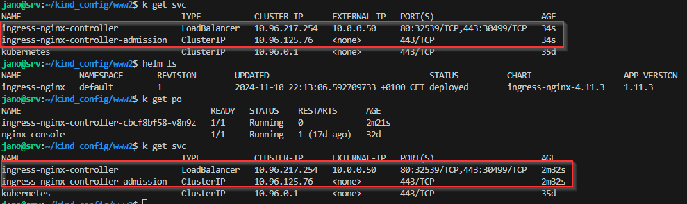
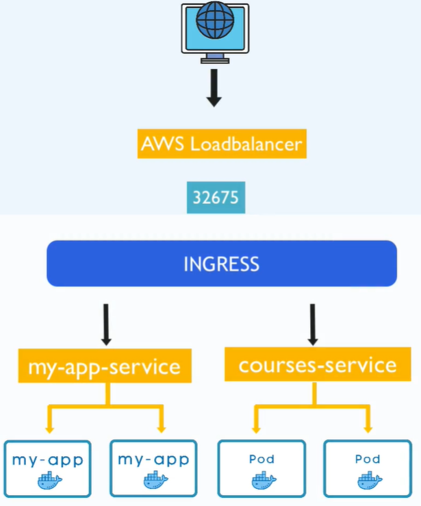
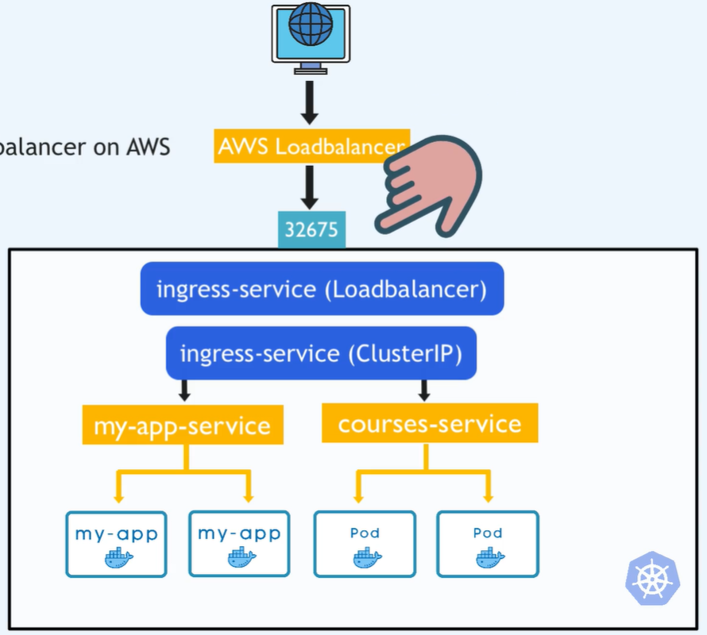

Utwóż ingress yaml za pomoca imperative commend
```
kubectl create ingress my-app-ingress \
--rule=host/path=service:port --dry-run=client -o yaml > my-app-ingress.yaml
```
konfigurację ingress 


```
- - = = Shemat przepływu ruchu = = - - 

Klient (zapytanie HTTPS na `example.com`) 
       ⬇
Certyfikat SSL weryfikuje domenę (połączenie zabezpieczone)
       ⬇
DNS wskazuje adres endpointa
       ⬇
Endpoint (np. FQDN Load Balancera w AWS)
       ⬇
Load Balancer (AWS ELB/ALB)
       ⬇
Traefik (Ingress Controller w Kubernetes)
       ⬇
IngressRoute (reguły routingu w Traefik)
       ⬇
Service (wewnętrzny routing w Kubernetes)
       ⬇
Deployment → Pod (aplikacja)
```