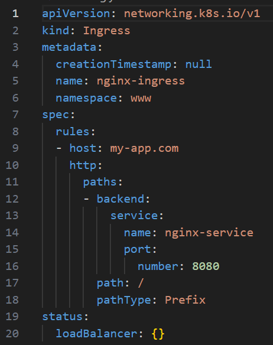

### ing


Plik ingres może zostać stwożon z użyciem CL
```bash
kubectl create ingress nginx-ingress \ 
--rule="my-app.com/*=nginx-service:8080" --namespace=www \ 
--dry-run=client -o yaml > www-ing.yaml
```

Ingress przekazuje zapytaia ClusterIP. W takim razie wszystkie dane (nazwa serwisu i port zawate w ClusterIP muszą się znaleźć w Ingress)




| Wiersz  | Opis            |
|---------|------------------|
| 7-18    | routing rules    |
| 9 | adres domeny (to co jest wpisywane w url). To powinien być entry point na zwnąrz klastra, bądź jeden z nodów, na którym zzlokalizowana jest aplikacja|  
| 13-16 | adres domen przekazywany jest do wewnętrzenego serwisu |
| 17-18 | to co wpisywane jest po domenie (np. http://my-app.com/```jano```)|
| 10 | nie ma to nic wspólnego, że aplikacja działającą na porcie 80. Odnosi się do nadchodzącego pytania, które zostaje przekazane do wewnętrznego serwisu |
|


backend - jest targetem gdzie przychodzące pytanie jest przekierowywane do servisu wewnętrznego.


Ingres musi wiedzieć do jakiego serwisu ma przekierować zapytanie, wiec nazwa musi być tożsama z nazwa servisu wewnętrznego/


Numer portu powinien być numerem portu wewnęrznego serwisu


Można publikować aplikację podając adres noda, na którym znajduje się obecnie pod   ```my-app``` wraz z portem.
Przy czym jest to dobre rozwiązanie dla samego testowania palikacji.

```bash
kubectl describe pod -n namespace cochise-xxxxxxxxx-xxxxx |grep 'Node:\|Port:'`
```

```
Node:         ip-124-89-101-2.eu-west-3.compute.internal/124.89.101.2
Port:         8080/TCP
```

Dla publikowania aplikacji dla klienta, wymagany był by protoków https oraz nazwa domenowa i to jest zadanie dla ingress.

Ingress -  forwarding dla serwisów, pozwala na konfigurecję routingu dla każdego z servisu, umożliwia bezpieczne połaczenie do aplikacji (https)


