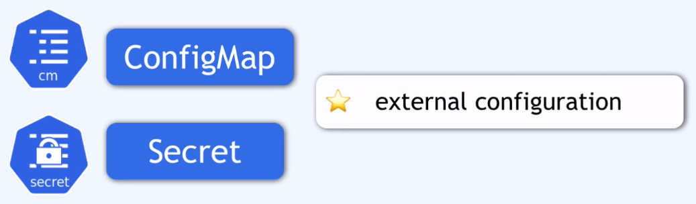
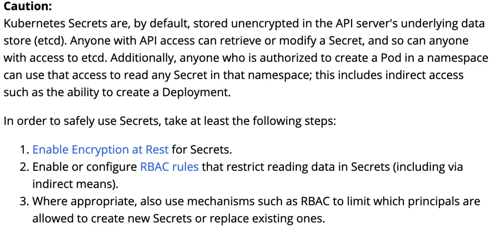

### secret



Secret jest takim samym komponentem jak ConfigMap ale słuzy do przechowywania danych tajnych jak użytkownik, hasło, certyfikat.

Dane przechowywane w postaci **based64** (to nie jest szyfrowanie, to jest jedynie format)



Dane mona w atry sposób zdeszyfrować 

```bash
echo "cGFzc3dvcmQ=" | base64 --decode
```

Jeśli masz wiele wartości w Secret, możesz szybko zdekodować wszystkie dane przy użyciu skryptu:

```bash
kubectl get secret -n <namespace> <secret> -o jsonpath='{.data}' | jq -r 'to_entries[] | "\(.key): \(.value | @base64d)"'
```