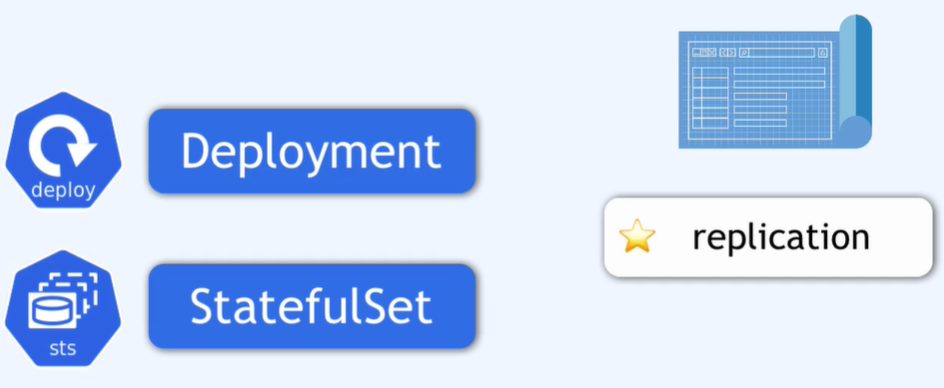
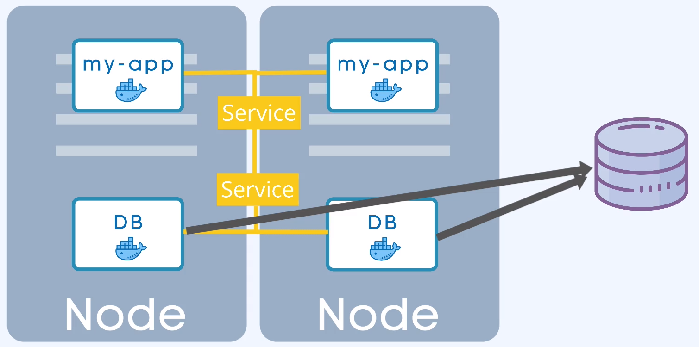
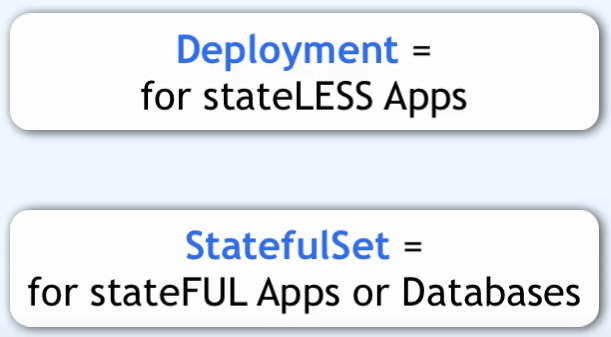

### sts

Jest to komponent secyficzny dla baz danych

Wszystkie aplikacje statefull lub bazy danych powinny być tworzone z urzyciem StatefullSet (not deployment)

StatefullSet tak jak Deployment  dba o ilość replik piluje synchronizacji zapisu i odczytu bazy danych

Wdrażanie StatefulSet nie jest łatwe (łatwiej wdrożyć aplilacje bazujące na deployment).

Rozwiązaneim może być baza danych która hostowana jest po za klastrem k8s. W tym przypadku posiadanie Deployment lub aplikacji stateless pozwala bez problemu replikować lub skalować. 
