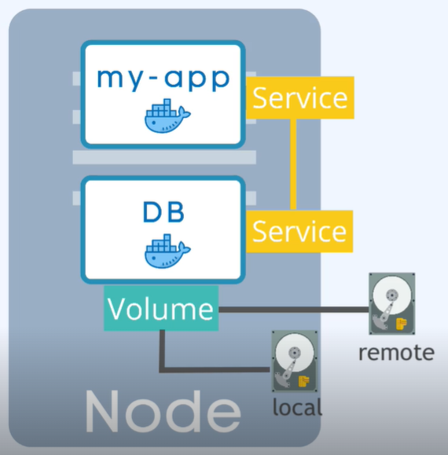

```yaml
title: "Volume"
linkTitle: "Volume"
weight: 11
version: 1.0
type: "docs"
description: >
```

### vol


Data Storage - rozwiązuje problem restartu poda zachowania danych podczas jego usówania i odzyskiwania w momencie jego tworzenia.

Jest to fisyczny storage podłaczony do servera (ec2). To może być lokalny storace seerwera lub zewnętrzny, po za klastrem k8s.


