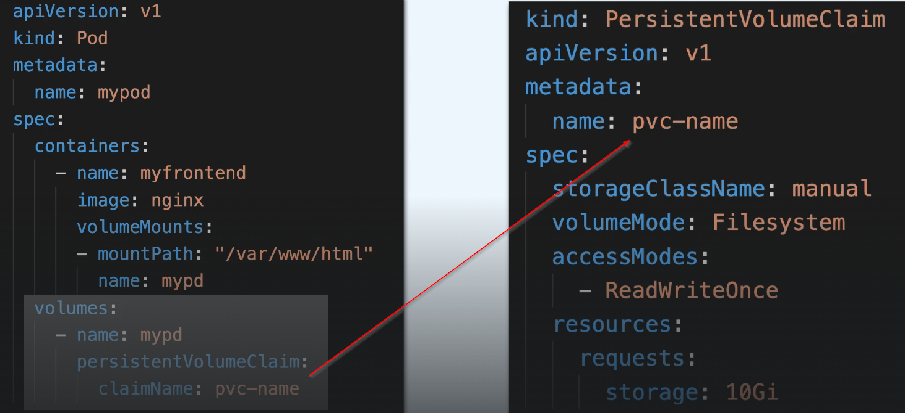
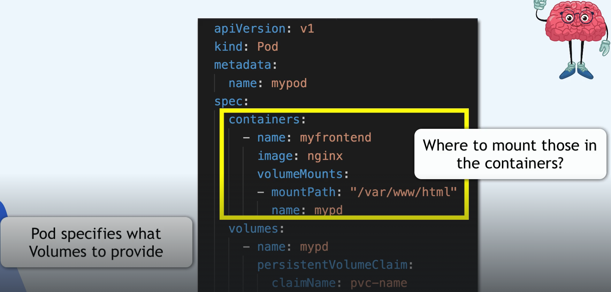
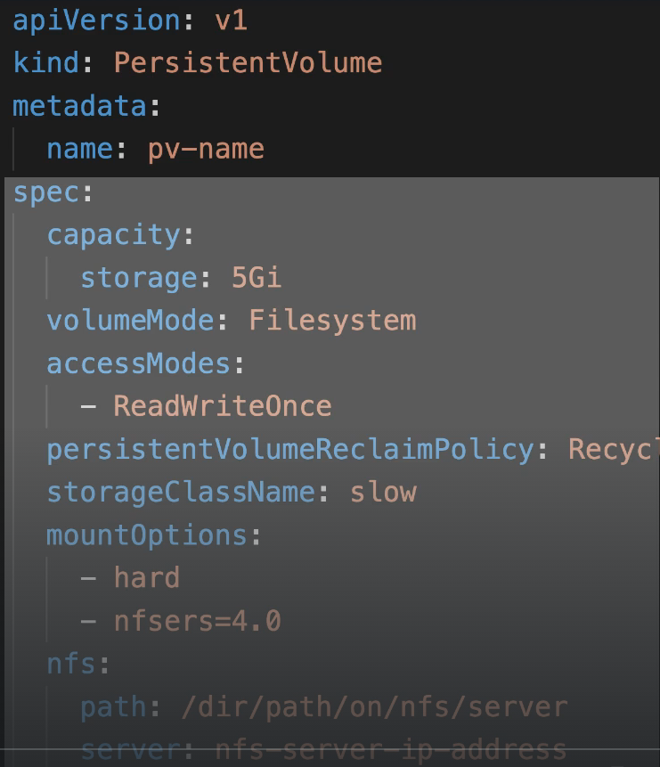
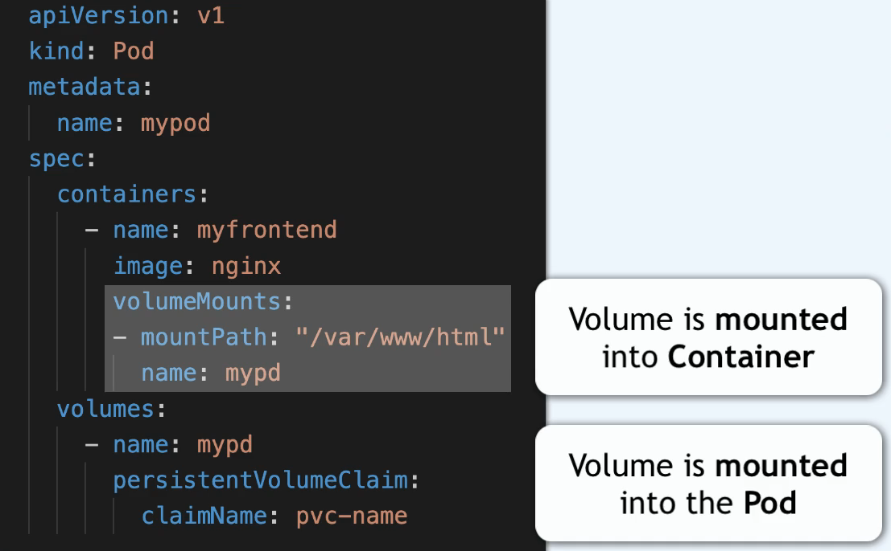
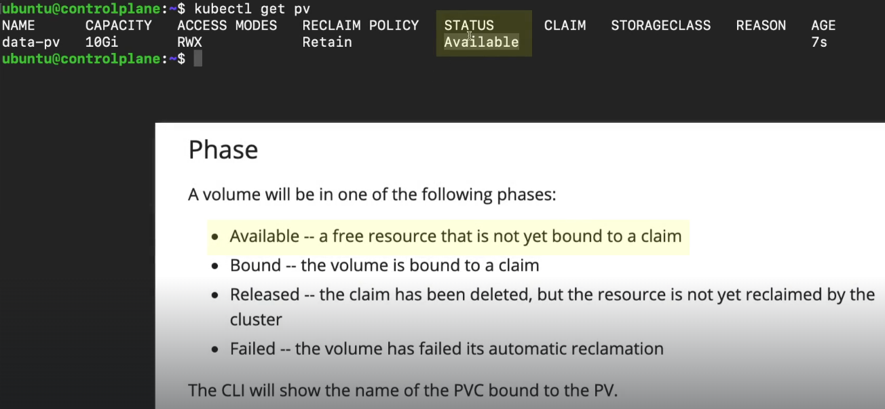
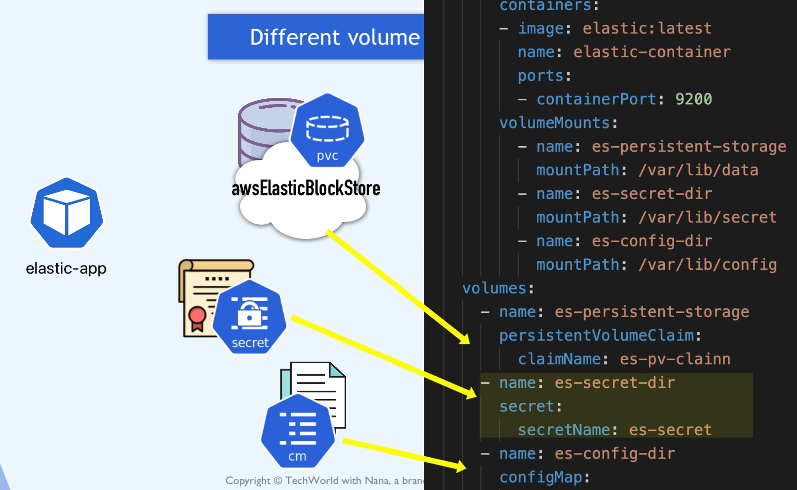
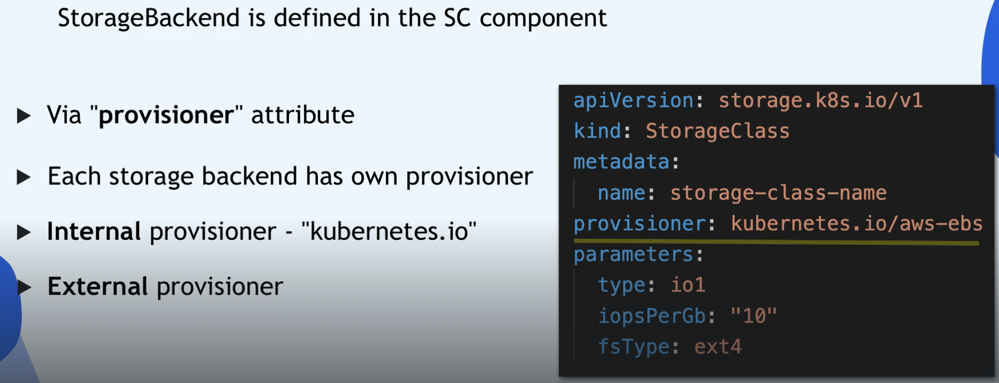
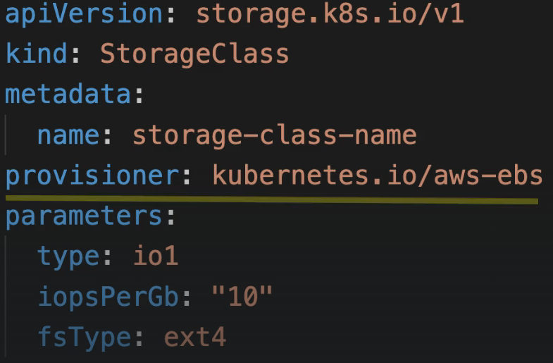
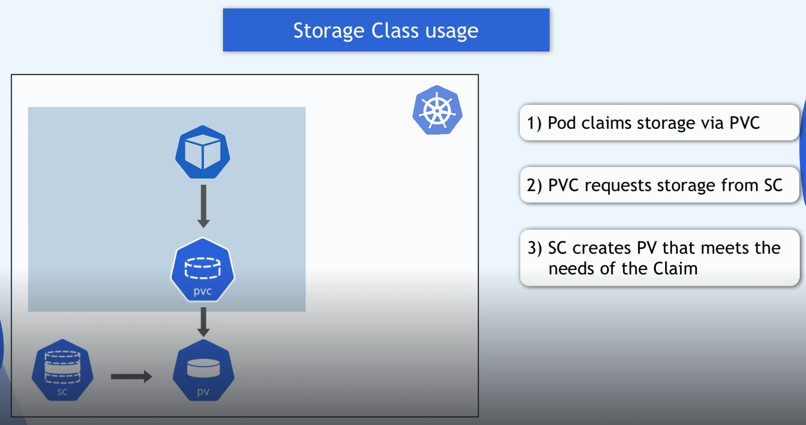

```yaml
title: "Volume"
linkTitle: "Volume"
weight: 11
version: 1.0
type: "docs"
description: >
```

### vol


Data Storage - rozwiązuje problem restartu poda, zachowania danych podczas jego usówania i odzyskiwania w momencie jego tworzenia.

Jest to fisyczny storage podłaczony do servera (ec2). To może być lokalny storace serwera lub zewnętrzny, po za klastrem k8s.


zapewnie:
- przestrze robocze dla podów
- wspdzielenie systemu plikw dla kontenerw w tym samym podzie
- przechowuje dane (nawer o restarcie poda są one dostępne)
  

  pod moze używac wiele voluminów
  po usunieciu oda usuwamy jest volumin efemeryczny ale nie pvc

  voluminy są montowane w określonych ścieżkach w systemie plków  
  !!! Dla każdego kontenera zdefiniowanego w podzie należy niezależnie określić miejsce zamontowania każdego woluminu używanego przez kontener. 
  Woluminy nie mogą być montowane w innych woluminach !!!

  The Kubernetes project suggests that you use the AWS EBS third party storage driver instead.

  The cephfs in-tree storage driver was deprecated in the Kubernetes v1.28 release and then removed entirely in the v1.31 release.

  ## configMap
  ConfigMap umożliwia wstrzykiwanie danych konfiguracyjnych do kontenerów. Do danych przechowywanych w ConfigMap można odwoływać się w woluminie typu, aconfigMap następnie wykorzystywać je w konteneryzowanych aplikacjach działających w kontenerze.

```yaml
apiVersion: v1
kind: Pod
metadata:
  name: configmap-pod
spec:
  containers:
    - name: test
      image: busybox:1.28
      command: ['sh', '-c', 'echo "The app is running!" && tail -f /dev/null']
      volumeMounts:
        - name: config-vol
          mountPath: /etc/config
  volumes:
    - name: config-vol
      configMap:
        name: log-config
        items:
          - key: log_level
            path: log_level.conf
```

## emptyDir
Wszystkie kontenery w Podzie mogą odczytywać i zapisywać te same pliki w emptyDirwoluminie, chociaż wolumin ten może być montowany w tych samych lub różnych ścieżkach w każdym kontenerze.

```yaml
apiVersion: v1
kind: Pod
metadata:
  name: test-pd
spec:
  containers:
  - image: registry.k8s.io/test-webserver
    name: test-container
    volumeMounts:
    - mountPath: /cache
      name: cache-volume
  volumes:
  - name: cache-volume
    emptyDir:
      sizeLimit: 500Mi
```

wtkożystywany jako cache, buffer aplikacji, pliki tymczasowe, suży do wymiany danych pomiędzy kontenerami.
Jeśli nie zostanie określona wartość `sizeLimit` to Pod może potencjalnie zająć całą dostępną pamięć efemeryczną (ephemeral storage) węzła.

jeśli określisz: 
```yaml
emptyDir:
  medium: Memory
```
wtedy dane trzymane są w RAM, nie na dysku — przez tmpfs (czyli system plików w pamięci operacyjnej).

| Cecha                         | `emptyDir`                                         | `hostPath`                                  |
| ----------------------------- | -------------------------------------------------- | ------------------------------------------- |
| Dane trwają po usunięciu Poda | Nie                                                | Tak (dopóki węzeł istnieje)               |
| Zależne od węzła              | Nie (tworzy się automatycznie na nowym)            | Tak                                       |
| Trwałość danych               | Krótkotrwała                                       | Lokalna dla węzła                           |
| Bezpieczeństwo                | Bezpieczne                                         | Potencjalnie ryzykowne                      |
| Użycie typowe                 | Cache, logi, współdzielone dane między kontenerami | Logi systemowe, narzędzia, monitoring hosta |
| Medium                        | Dysk lub RAM (`medium: Memory`)                    | Zawsze dysk hosta                           |
| Wpływ na hosta                | Żaden                                              | Może zmienić dane hosta                     |

```yaml
apiVersion: v1
kind: Pod
metadata:
  name: hostpath-example-linux
spec:
  os: { name: linux }
  nodeSelector:
    kubernetes.io/os: linux
  containers:
  - name: example-container
    image: registry.k8s.io/test-webserver
    volumeMounts:
    - mountPath: /foo
      name: example-volume
      readOnly: true
  volumes:
  - name: example-volume
    # mount /data/foo, but only if that directory already exists
    hostPath:
      path: /data/foo # directory location on host
      type: Directory # this field is optional
```




| **Wartość dla type**| **Znaczenie / Zachowanie**                                                                                                                            | **Kiedy używać**                                                                                         |
| ------------------- | ----------------------------------------------------------------------------------------------------------------------------------------------------- | -------------------------------------------------------------------------------------------------------- |
| `""` *(pusty ciąg)* | Domyślna wartość (brak sprawdzeń). <br> 🔹 Kubernetes **nie weryfikuje**, co znajduje się w tej ścieżce – może to być katalog, plik, cokolwiek.    | Gdy wiesz, że ścieżka na hoście **zawsze istnieje**, albo nie zależy Ci, co tam jest.                    |
| `DirectoryOrCreate` | Jeśli katalog **nie istnieje**, Kubernetes **utworzy nowy pusty katalog** z uprawnieniami `0755`. <br> 🔹 Właścicielem będzie użytkownik Kubeleta. | Gdy chcesz mieć pewność, że katalog **zawsze istnieje**, nawet na świeżym węźle.                         |
| `Directory`         | Wymaga, żeby katalog **już istniał** w tej ścieżce. <br> Jeśli go nie ma → Pod się **nie uruchomi**.                                               | Gdy chcesz użyć **konkretnego katalogu systemowego**, np. `/var/log`.                                    |
| `FileOrCreate`      | Jeśli plik **nie istnieje**, Kubernetes **utworzy pusty plik** z uprawnieniami `0644`.                                                             | Gdy chcesz, by Pod zapisywał np. logi w jednym pliku, który może być tworzony automatycznie.             |
| `File`              | Wymaga, żeby plik **już istniał** w danej ścieżce. <br> Jeśli nie istnieje → błąd przy starcie Poda.                                               | Gdy chcesz mieć pewność, że montujesz **konkretny plik konfiguracyjny** lub urządzenie.                  |
| `Socket`            | Wymaga, żeby w ścieżce znajdowało się **gniazdo UNIX (socket)**.                                                                                   | Gdy Twój Pod ma komunikować się z usługą hosta przez socket, np. Docker daemon (`/var/run/docker.sock`). |
| `CharDevice`        | (Linux) Wymaga **urządzenia znakowego**, np. `/dev/tty` lub `/dev/null`.                                                                           | Dla aplikacji potrzebujących dostępu do urządzeń znakowych.                                              |
| `BlockDevice`       | (Linux) Wymaga **urządzenia blokowego**, np. `/dev/sda`, `/dev/xvdf`.                                                                              | Gdy kontener potrzebuje bezpośredniego dostępu do dysku lub partycji.                                    |

### sekret
Wolumin secretsłuży do przesyłania poufnych informacji, takich jak hasła, do kontenerów

### csi
Interfejs Container Storage Interface (CSI) definiuje standardowy interfejs dla systemów koordynacji kontenerów (takich jak Kubernetes) umożliwiający udostępnianie dowolnym systemom pamięci masowej obciążeń kontenerowych.
z pvc, z emptyDir

administrator jest oppowiedziałny za wdrożenie właściwej wtyczki CSI dla wybranego srorage.

---

Pod = aplikacja <br/>
PV (PersistentVolume) = dysk fizyczny / storage backend <br/>
PVC (PersistentVolumeClaim) = prośba o kawałek tego dysku (najczęściej cały kawałek 1:1) <br/>
ConfigMap → dane konfiguracyjne w formie plików, <br>
Secret → dane wrażliwe,<br>
DownwardAPI → dane o samym podzie (np. nazwa, namespace, limity CPU itp.),<br>
emptyDir → tymczasowy katalog,<br>
hostPath → folder z węzła,<br>

Domyślnie:
1 PV to 1 PVC (1:1)

Ale jeśli masz storage z obsługą RWX (np. NFS, EFS, CephFS), wtedy:
1 PV to wiele PVC / wiele podów moe robić zapis odczyt ze storaga.



| Tryb       | Kto może korzystać            | Gdzie używać                                 |
| ---------- | ----------------------------- | -------------------------------------------- |
| **RWO** | tylko 1 pod                   | bazy danych, single instance                 |
| **ROX** | wiele podów, tylko do odczytu | statyczne dane, konfiguracje                 |
| **RWX** | wiele podów, odczyt i zapis   | współdzielone katalogi, aplikacje skalowalne |

kubernetes nie daje domyślnie żadngo storage dla poda (po za przestrzenią noda na  którym pod startuje), ale jest to tymczasowy storage, jest usówany gdy pod jest restartowany.
Ty jesteś zobowiązany do utworzenia dedykowanego storage dla poda (który trwa pojego restarcie) a replika storaga realizowana jest na przynajniej 2 nodach (2 z 3 dostępnych az) jełśi właczone zostanie więcej replik, wzrośnie letencja dla zapisu (zapis do jednego storaga + replika na 2 pozostałe storage)




volumen jet niezaleny od nodw k8s, istnieje po ich restarcie.


## PV - persistence volume
Należy sprawdzić status PV aby wiedzieć czy został już przypisany do PVC lu inne poniżej.


## PVC - persistence volume claim

## SC

## CongigMap
Jest lokalnym volumenem, nie jest tworzony prezez PV/PVC, zarzdzany prze kubernetes

## Secret
Jest lokalnym volumenem, nie jest tworzony prezez PV/PVC, zarzdzany prze kubernetes
obiekt typu Secret może (i bardzo często jest) używany do przechowywania certyfikatów TLS/SSL, kluczy prywatnych, haseł, tokenów itp.
dane przechowywane są w postaci Base64

jeden pod moze mieć podłaczonych kilka różnych volumentów jednocześnie


## storage class


`storagebackend` jest zdefiniowane w Storage Class component po przez atrzybut `provisioner` każdy storebacend ma własny provisioner
internal provisioner provisioner: kubernetes.io/portworx-volume, provisioner: kubernetes.io/aws-ebs ...

Provisioner to komponent, który tworzy fizyczny wolumen (PV) na podstawie żądania PVC. Przykłady: <br>
- kubernetes.io/aws-ebs – tworzy dysk EBS w AWS.
- kubernetes.io/gce-pd – tworzy Persistent Disk w Google Cloud.
- kubernetes.io/portworx-volume – używa Portworx do zarządzania wolumenami.
- rbd.csi.ceph.com – provisioner dla Ceph RBD przez CSI.


do każdego provisioningu należy utworzyć parametr jakie chemy PV (Storage parameter)

jak trorzony jest pvc w klastrze k8s


jęśli chcesz przechowywać dane króre będą trwałe ni niezależne od nodów k8s musisz użyć remote storage volume.
jeśli jegnak nie zależy ci na ich trwałosci, lepiej użuć local volume

jednym z lokalnych vloominw jest `hotPath` dostny na pojedyczym nodzie, z przyczyn security powinno się go unikać

Gdy PVC zostaje przypisany do PV → claimRef jest ustawiony, a status.phase = Bound.
Gdy PVC zostaje usunięty → status.phase = Released, ale claimRef nadal istnieje.
Gdy usuniesz claimRef → Kubernetes może zmienić status.phase na Available.

kontroler PersistentVolumeClaim w komponencie Kube Controller Manager realizuje zadania.

1. Monitoruje wszystkie PVC w klastrze.
1. Szuka dostępnych PV, które:
- mają zgodny storageClassName,
- spełniają wymagania accessModes i capacity,
- są w stanie Available (czyli nie mają claimRef).
1. Jeśli znajdzie pasujący PV:
- ustawia claimRef w PV,
- zmienia status.phase PV na Bound,
- zmienia status PVC na Bound.


Nazwy `storageClassName` są dowolne, ale:
Muszą być identyczne (tożsame) między PV i PVC, żeby doszło do powiązania.
Nie ma znaczenia, czy nazwa to manual, local, fast, slow, ssd, itp. — ważne, żeby była taka sama w obu obiektach.(może być pustą wartością ```storageClassName: ""```, ale mysui być !!!)
```yaml
apiVersion: v1
kind: PersistentVolume
metadata:
  name: task-pv-volume
  labels:
    type: local
spec:
  storageClassName: manual
  capacity:
    storage: 10Gi
  accessModes:
    - ReadWriteOnce
  hostPath:
    path: "/mnt/data"
```

`storageClassName` to etykieta, która musi się zgadzać między PV i PVC.
W przypadku dynamicznego provisioningu, storageClassName wskazuje na konkretny obiekt `StorageClass`, który zawiera informacje o tym, jak utworzyć PV (np. przez CSI, AWS EBS, itp.).
W przypadku statycznego provisioningu, storageClassName służy tylko do dopasowania PV do PVC — nie wywołuje żadnego provisionera.

Używaj etykiet i selektorów które umożliwoą powiązanie pv do pvc niezależnie od kolejnosci tworzenia. W ten sposób unikasz błędnego powiazania.

```yaml
apiVersion: v1
kind: PersistentVolume
metadata:
  name: pv-cochise
  labels:
    volume: cochise
spec:
  hostPath:
    path: "/mnt/data/cochise"
  capacity:
    storage: 5Gi
  accessModes:
  - ReadWriteOnce
  storageClassName: ""
---
apiVersion: v1
kind: PersistentVolumeClaim
metadata:
  name: pvc-cochise
spec:
  selector:
    matchLabels:
      volume: cochise
  resources:
    requests:
      storage: 5Gi
  accessModes:
  - ReadWriteOnce
  storageClassName: ""
```
Jeżeli nie używał byś labeli w pv oraz selectora w pvc, to ti ytworztł być najpierw pv-postgres a potem pvc-cochise to etcd je ze sobą powiąze

Jeeli zachodzi potrzeba zmiany pv / pvc , można to zrobić za pomoca edit 'kubectl edit pv ...' lub poprzez aktualizacjię skryptu 'storage: 5Gi -> 6Gi' a następnie 'kubectl replace -f ex-pv.yaml' ps nie zapomnij o zwiekszeniu pvc
