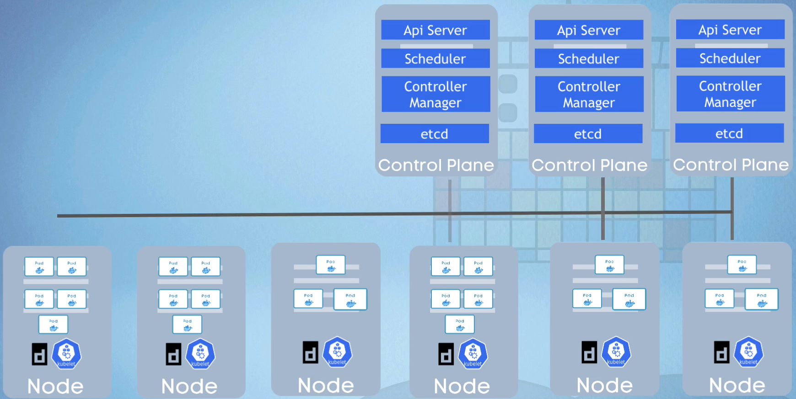
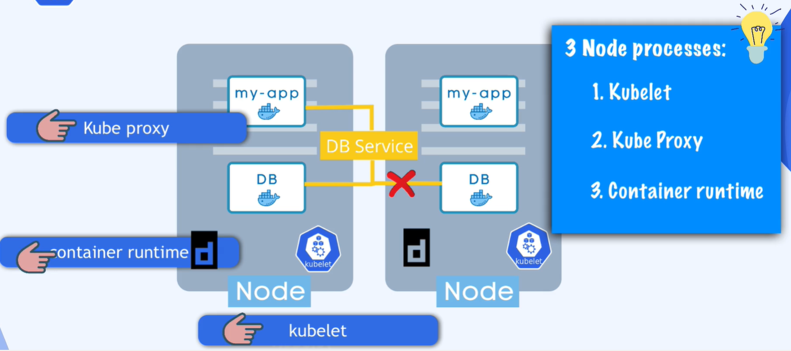

Istnieje dwa rodzaje nodów.
Master node i Worker node. Kazdy z nich pełni inna funkcje w klastrze

## Worker node

Na każdym nodzie może istnieć wiele podów.
Na każdym nodzie muszą być zainstalowane trzy procesy:

1. container runtime -  uruchamia kontenery, (api,sched,c-m,etcd to też kontenery), może to by: docer / container_d / crio-o
Docker runtime jest pierwszym Container Runtime który posiadanie kodu do komunikacji z dockr bezpośrednio w kodzie kubeleta

2. kubelet - odpowiada za pobranie konfiguracji i właściwa prace noda i podów (z kontynerem wew). Przypisuje zasoby noda do kontenera (cpu/ram/storage)
rozmawia z docketem w celu zaplanowania kontenerów. Odpowiedzialny za zarządzanie kontenerami węzła klastra.
    Zarządzanie kontenerami: Kubelet monitoruje i zarządza kontenerami na węźle klastra. Odpowiada za uruchamianie, zatrzymywanie i restartowanie kontenerów zgodnie z zadeklarowanym stanem.

    - Kontrola cyklu życia kontenerów: Kubelet zapewnia, że kontenery są utrzymywane w zadeklarowanym stanie, co oznacza, że jeśli kontener ulegnie awarii, zostanie automatycznie ponownie uruchomiony.
    - Zgłaszanie stanu: Kubelet monitoruje stan kontenerów i zbiera informacje na ich temat. Informacje te są przesyłane do kontrolera zarządzania węzłami (Node Controller), co pozwala na zarządzanie węzłami klastra.
    - Obsługa zasobów i ograniczeń: Kubelet dba o to, aby kontenery używały przypisanych im zasobów (CPU, pamięć, itp.) oraz przestrzeni dyskowej.
    - Komunikacja z API serwera: Kubelet komunikuje się z API serwera Kubernetes, aby otrzymywać informacje o zadanym stanie oraz przesyłać aktualizacje i raporty o stanie węzła.
    - Zarządzanie certyfikatami: Kubelet zarządza certyfikatami X.509 wykorzystywanymi do uwierzytelniania węzła w klastrze.
    - Montowanie woluminów: Kubelet obsługuje montowanie woluminów do kontenerów. Gwarantuje, że woluminy są dostępne i gotowe do użycia przez kontenery.

3. kube proxy - odpowiedzialny za komunikację (LB-service-pod). odpowiedzialny za przekazywanie zapytań z komponentu Service do poda

