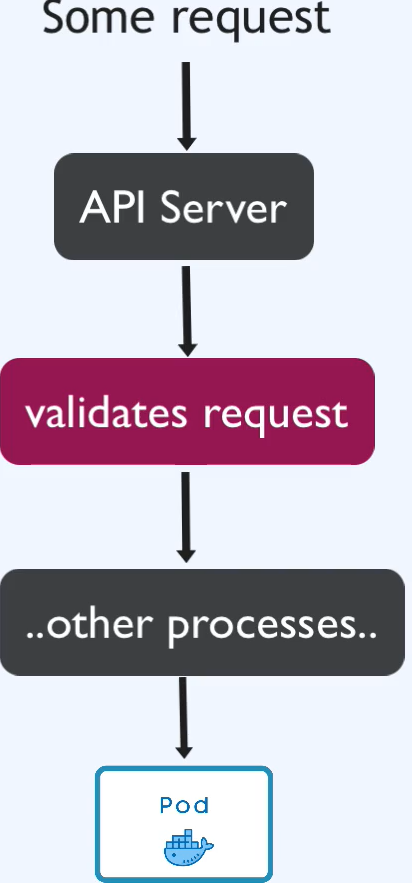
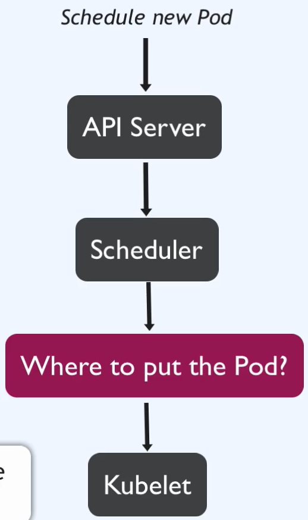
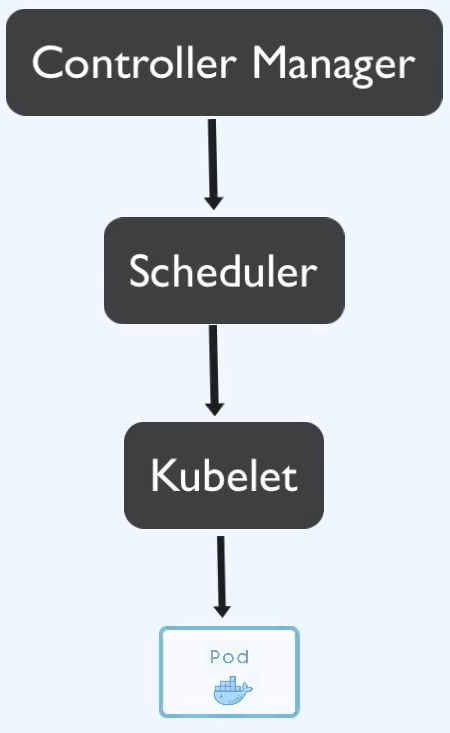
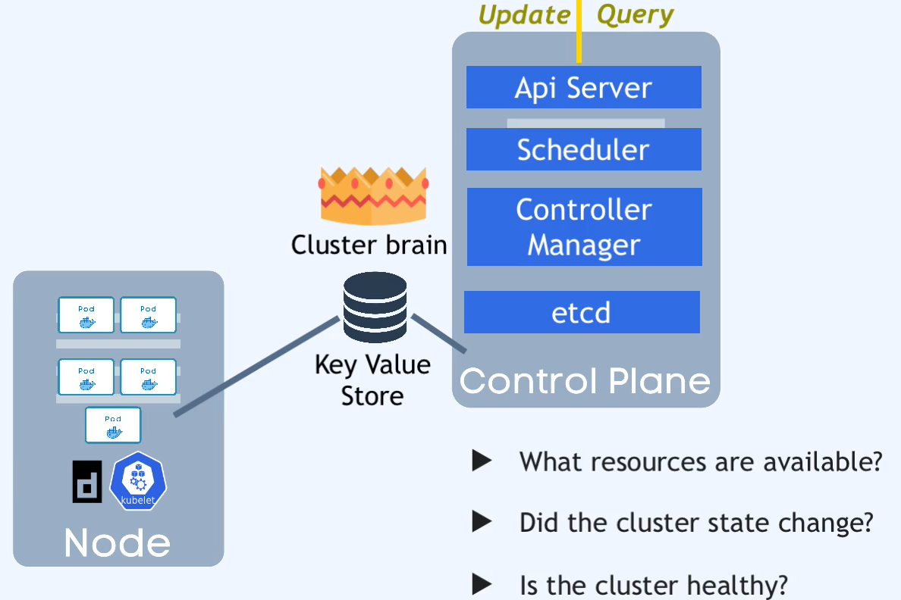

Istnieje cztery procesy działające na każdym master nodezie

1. api server -  Jest jak cluster GW. Punkt wejściowy do klastra.
Jeśli posiadam na swoim komputerze odpowiedni certyfikat generowany przez kubeadm (./kube/config) i mam zainstalowane narzędzie kubectl, to poprzez api server moge administrować klastrem.

```bash
./kube/config = /etc/kubernetes/admin.conf
```
   
   Jest to komponent Kubernetes, który odpowiada za uwierzytelnianie żądań przychodzących do klastra. To główny punkt wejścia, przez który użytkownicy oraz różne komponenty komunikują się z klastrem.
   
   W kontekście "acts as a gatekeeper for authentication", można zinterpretować, że Kubernetes pełni rolę bramki kontrolującej proces uwierzytelniania. API Server jako główny punkt wejścia przyjmuje żądania uwierzytelniające i korzystając z różnych mechanizmów uwierzytelniania oraz dostępnych informacji, potwierdza tożsamość podmiotu (użytkownika lub komponentu). To jest kluczowy element w zapewnianiu bezpieczeństwa w klastrze Kubernetes, kontrolując dostęp do zasobów na podstawie uwierzytelnienia.
   
   Jeśli chesz zaktualizaować kontener w podzie, twoje zapytanie wchodzi najpierw do API Server gdzie jest przetwarzane, sprawdzane czy jest ono autoryzowane, jeśli tak to przekazywane jest od innego procesu a następne tworzony jest pod z nowym kontenerem.
   
   

Jest pto dobrze rozwiazanie z puunktu widzenia bezpieczeństwa. Jest to pojedyńczy punkt wejścia do klastra.

2. Scheduler - odpowiada za przydzielenie najmniej obciążonego noda dla nowo tworzonego poda. Procesem utworzenia poda na konkretnym nodezie zajmuje sie kubelet. 
   
   Scheduler sprawdza jakie zasoby potrzebne są dla nowego poda i porównuje z wolnymi zasobami nodów (CPU/RAM). Decyduje, na którym modzie utworzyć poda.



3. Controller Manager - wykrywa zmiany stanu klastre, zapewnia jego integralność, odtwarze stan podów w klastrze z przed awarii. Gdy nod przestanie istnieć to lub tylko pod przestanie istnieć (pod die) Controler Manager wykrywa ten stan i przekazuje do Schedulera informacje o konieczności stworzenia nowego poda.
   
   

ETCD - magazyn wartości kluczy, mózg klastra. przechowuje wszystkie zmiany w klastrze. Posiada komplet informacji o statusie nodów, ich zasobach oraz lokalizacji podow w nodach (blueprint). 

Przechowuję aktualny status wszystkich komponentów klastra. Posiada informacja ile jest działających na chwilę obecną relik danego deploymenu.

Application data nie jest przechowywane w ETCD.



Najmniejszy klaster powinien zawierać przynajmniej 2 master nody (replikacja dla etcd oraz load ballancer dla Api Server).

Master node nie potrzebuje tak duzych zasobów CPU, RAM, Storage jak worker node. Master zajmuje się procesami kontrolnymi, jest mniej "zasobożerny" 
Worker node musu zapewnić odpowiednią wydajność dla działających podów.

Wszystkie dane (deployment/pod/service/configMap/secret) przechowywane są w ETCD, co znaczy że jeżeli etcd  zostanie uszkodzony, to staracimy dane klastra, brak informacji o cluster state.
Dlatego zaleca się wykonywanie regularnych kopii zapasowych etcd oraz replikację danych etcd na wiele węzłów w klastrze, aby zapewnić wysoką dostępność i odporność na awarie (kilka master nodów).
Dane etcd zapisywane są na storage node nie na persistant bolume (zewnętrznym storage)
