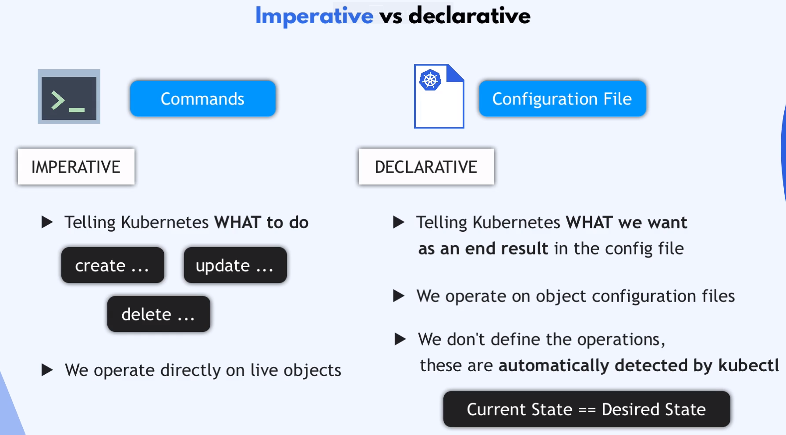
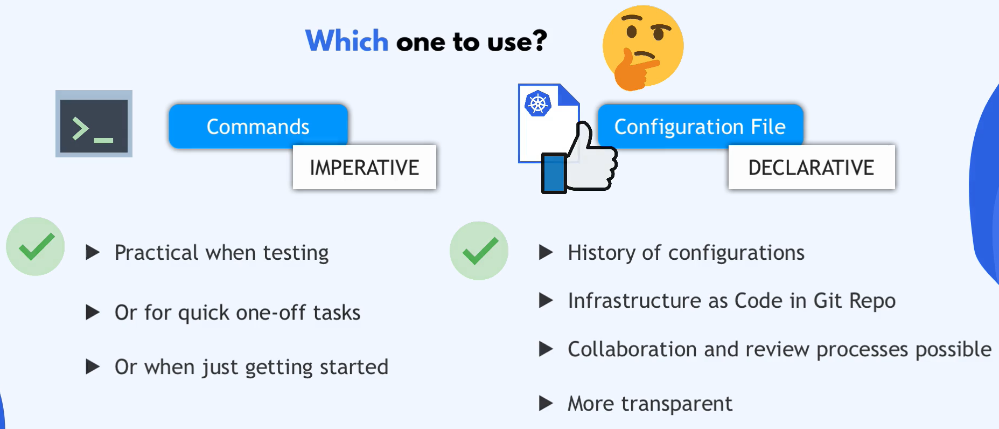

## kubectl

kubectl - k8s CLI (kube control). Za pomoca tego nażędzia możesz stworzyć, lub usunąć dowolny obiekr (deployment, ..)

```bash
kubectk create <object_type><instance_name>
kubectk delete <object_type><instance_name>

kubectk get         ## podstawowe informcje
kubectk describe    ## szczegółowe informacje
kubectk logs        ## logi kontenera
```

## Configuration File

Configuration File - nazywany również ## kubernetes manifest
 Dla wykonywania bardziej skomplikowanych operacji.

wszystkie informacje na temat komponentów konfiguracyjnych replik, portów, .. zapisujessz w pliku *.yaml, który następnie uruchamiany jest za pomocą kubectl

```bash
kubectl apply -f *.yaml
```

Możesz nawet mieć zadeklarowanych wiele komponentów w jednym configuration file.

Jeżeli zajdzie porzeba aktualizacji jakiegoś komponenuty, możesz wyedytować konfiguration file i zatwierdzic zmianę (w ten sam sposób jak powyżej.)

Możesz również w łatwy sposów usunąć wszystkie komponnty.

```bash
kubectl delete -f *.yaml
```

# podsumowanie




