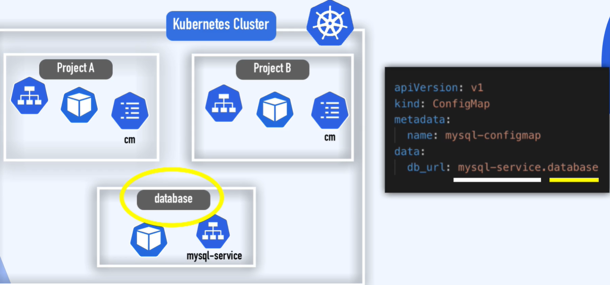

namespace - virtualny klaster wewnątrz klastrak k8s

po zainstalowaniu klastra, tworzone sa 4 podstawowe NS
NAME              STATUS   AGE
default           Active   24h
kube-node-lease   Active   24h
kube-public       Active   24h
kube-system       Active   24h

możesz również storzyć własny ns 

```bash
kubectl create ns dj-test
```

Lepszym sposobem na twożenie ns jest użycie pliku konfiguracyjnego, ponieważ mamy historie w w repozytorium plików jakie zasoby były tworzone w klastrze.

```bnash
apiVersion: v1
kaind: ConfigMap
metadate:
  name: mysql-confgmap
  namespace: dj-test
data:
  db_url: mysql_service.database
```

ns umożliwia grupowanie obiektów ze wzgledu na klienta, charakter danego zasobu (monitoring,..)
ns powinien być używany do małego projektu przekraczającego 10 użytkowników.
przy czym ze względów bazpieczeństwa i kultury pracy jaki esterycznych lepiej tworzyć ns dla kazdego zasoby wdrażanego do klastra.
Może się zdażyć że kilka teamów spadnie na pomysł pracy na deefoultowym ns, w konsekwencji bądą nadlisywali swoja pracę.
Używanie pre-production, service, support and production environment na tym samym klastrze, należy rozróznić te środowiska (rozwiązanie zwane Blue/Green deploymnt).
posiadając różne ns możesz limitować zasoby cpu/ram/storage dla kazdego ns.


Jeżeżeki dwa projekty mają tą sama referencję, kozystają z tej samej bazy danych to i tak każdy z nich musi mieć zdeklarowany osobny ConfigMap, Secret. Prrojekty moga mieć wspólny service (mysql-service).
Jeśli baza danych znajduje sie w osobnym NS to w "db_url" można podać NS zamiast nazwy bazy.



VOL & NODE - są zasoby które nie sa grupowane w NS, żyją globalnie w klastrze k8s, nie można ich izolować

Aby wilistować komponenty, które nie są powiązane z NS uzyj komendy

```bash
kubectl api-resources --namespaced=false


NAME                              SHORTNAMES   APIVERSION                             NAMESPACED   KIND
componentstatuses                 cs           v1                                     false        ComponentStatus
namespaces                        ns           v1                                     false        Namespace
nodes                             no           v1                                     false        Node
persistentvolumes                 pv           v1                                     false        PersistentVolume
mutatingwebhookconfigurations                  admissionregistration.k8s.io/v1        false        MutatingWebhookConfiguration
validatingwebhookconfigurations                admissionregistration.k8s.io/v1        false        ValidatingWebhookConfiguration
customresourcedefinitions         crd,crds     apiextensions.k8s.io/v1                false        CustomResourceDefinition
apiservices                                    apiregistration.k8s.io/v1              false        APIService
selfsubjectreviews                             authentication.k8s.io/v1               false        SelfSubjectReview
tokenreviews                                   authentication.k8s.io/v1               false        TokenReview
selfsubjectaccessreviews                       authorization.k8s.io/v1                false        SelfSubjectAccessReview
selfsubjectrulesreviews                        authorization.k8s.io/v1                false        SelfSubjectRulesReview
subjectaccessreviews                           authorization.k8s.io/v1                false        SubjectAccessReview
certificatesigningrequests        csr          certificates.k8s.io/v1                 false        CertificateSigningRequest
flowschemas                                    flowcontrol.apiserver.k8s.io/v1beta3   false        FlowSchema
prioritylevelconfigurations                    flowcontrol.apiserver.k8s.io/v1beta3   false        PriorityLevelConfiguration
ingressclasses                                 networking.k8s.io/v1                   false        IngressClass
runtimeclasses                                 node.k8s.io/v1                         false        RuntimeClass
clusterrolebindings                            rbac.authorization.k8s.io/v1           false        ClusterRoleBinding
clusterroles                                   rbac.authorization.k8s.io/v1           false        ClusterRole
priorityclasses                   pc           scheduling.k8s.io/v1                   false        PriorityClass
csidrivers                                     storage.k8s.io/v1                      false        CSIDriver
csinodes                                       storage.k8s.io/v1                      false        CSINode
storageclasses                    sc           storage.k8s.io/v1                      false        StorageClass
volumeattachments                              storage.k8s.io/v1                      false        VolumeAttachment
```

lub gdy chesz wyświetli zaoby powiązane z NS

```bash
kubectl api-resources --namespaced=true


NAME                        SHORTNAMES   APIVERSION                     NAMESPACED   KIND
bindings                                 v1                             true         Binding
configmaps                  cm           v1                             true         ConfigMap
endpoints                   ep           v1                             true         Endpoints
events                      ev           v1                             true         Event
limitranges                 limits       v1                             true         LimitRange
persistentvolumeclaims      pvc          v1                             true         PersistentVolumeClaim
pods                        po           v1                             true         Pod
podtemplates                             v1                             true         PodTemplate
replicationcontrollers      rc           v1                             true         ReplicationController
resourcequotas              quota        v1                             true         ResourceQuota
secrets                                  v1                             true         Secret
serviceaccounts             sa           v1                             true         ServiceAccount
services                    svc          v1                             true         Service
controllerrevisions                      apps/v1                        true         ControllerRevision
daemonsets                  ds           apps/v1                        true         DaemonSet
deployments                 deploy       apps/v1                        true         Deployment
replicasets                 rs           apps/v1                        true         ReplicaSet
statefulsets                sts          apps/v1                        true         StatefulSet
localsubjectaccessreviews                authorization.k8s.io/v1        true         LocalSubjectAccessReview
horizontalpodautoscalers    hpa          autoscaling/v2                 true         HorizontalPodAutoscaler
cronjobs                    cj           batch/v1                       true         CronJob
jobs                                     batch/v1                       true         Job
leases                                   coordination.k8s.io/v1         true         Lease
endpointslices                           discovery.k8s.io/v1            true         EndpointSlice
events                      ev           events.k8s.io/v1               true         Event
ingresses                   ing          networking.k8s.io/v1           true         Ingress
networkpolicies             netpol       networking.k8s.io/v1           true         NetworkPolicy
poddisruptionbudgets        pdb          policy/v1                      true         PodDisruptionBudget
rolebindings                             rbac.authorization.k8s.io/v1   true         RoleBinding
roles                                    rbac.authorization.k8s.io/v1   true         Role
csistoragecapacities                     storage.k8s.io/v1              true         CSIStorageCapacity
```

