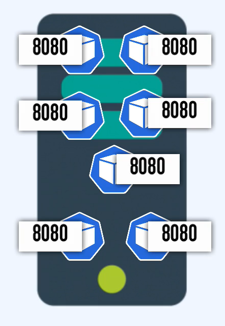
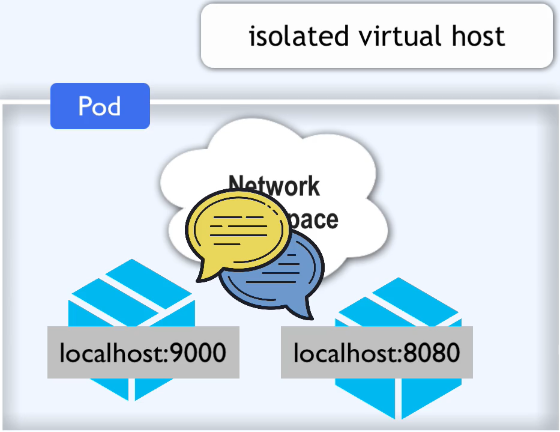
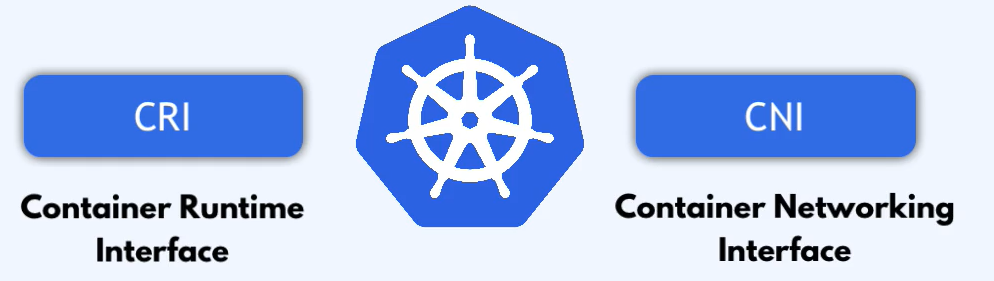

kazdy pod klastra ma unikalny IP
każdy pod to jak PC
każdy pod może miec 1-6 kontenerów.

gdy padnie kontener w podzie to nowy konterner dostaje ten sam ip adres (wewnątrz poda)
gdy padnie pod nadawane są nowe adresu dla wpółpracujących ze sobą kontenerów.

CNI - container networking interface (basicly netwok or inter pod commmunication)
jak pddy komunokują się wzajemnie ze sobą

Kubernetes nie dostarcza rozwiązania sieciowego w podstawie, jestś zobliowrany do wdrożenie 'sieci' we własnym zakresie.
