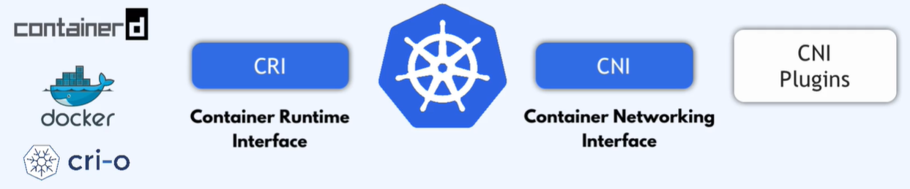
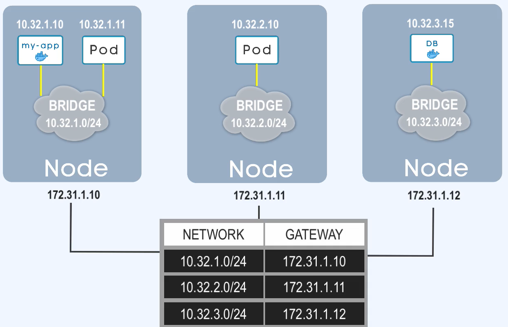

kazdy pod klastra ma unikalny IP
każdy pod to jak PC
każdy pod może miec 1-6 kontenerów.

gdy padnie kontener w podzie to nowy konterner dostaje ten sam ip adres (wewnątrz poda)
gdy padnie pod nadawane są nowe adresu dla wpółpracujących ze sobą kontenerów.

CNI - container networking interface (basicly netwok or inter pod commmunication)
jak pddy komunokują się wzajemnie ze sobą.
jest zbiorem ról i definicji sieciowych.

Kubernetes nie dostarcza rozwiązania sieciowego w podstawie, jestś zobliowrany do wdrożenie 'sieci' we własnym zakresie.

CNI to ten sam koncept co CRI (container rntime interface)

### CNI Plugins requirements
każdy pod musi mieć unikalny adres ip w całym klastrze
k8s nie dba o zakres adresacji jaka zostanie zaimplementowana w klastrze (CIDR),
implenantacja zakresu realizowana jest na pozimie cni pliginu.

 - [lista providerów CNI Plugins](https://kubernetes.io/docs/concepts/cluster-administration/addons/#networking-and-network-policy)

adresacja nodów i podów nie może sie nakładać (overlaping)
przed zaimplementowaniem pluginu sprawdzę i porównaj cidr vpc, naktoreym zstały zaimplementowane nody oraz cidr plaginu ktory będzie redystrybupował adresacje dla podów.

Komuikacja podów pomiędzy nodami realizowane przez bramy sieciowe.

Bridge na oprazku powużej, jest wirtualnym podem tworzonuem na każdym z nodów klastra.
Bramy te, pody odpowiadaja za komunikacje miedzy podami aplikacji (np web i db na róznych nodach).
Bramy posiadaja tablicę rutingu, ułatwia to komunikacje pomiędzy podami na róznaych nodach i w obrębie tego samego noda.
