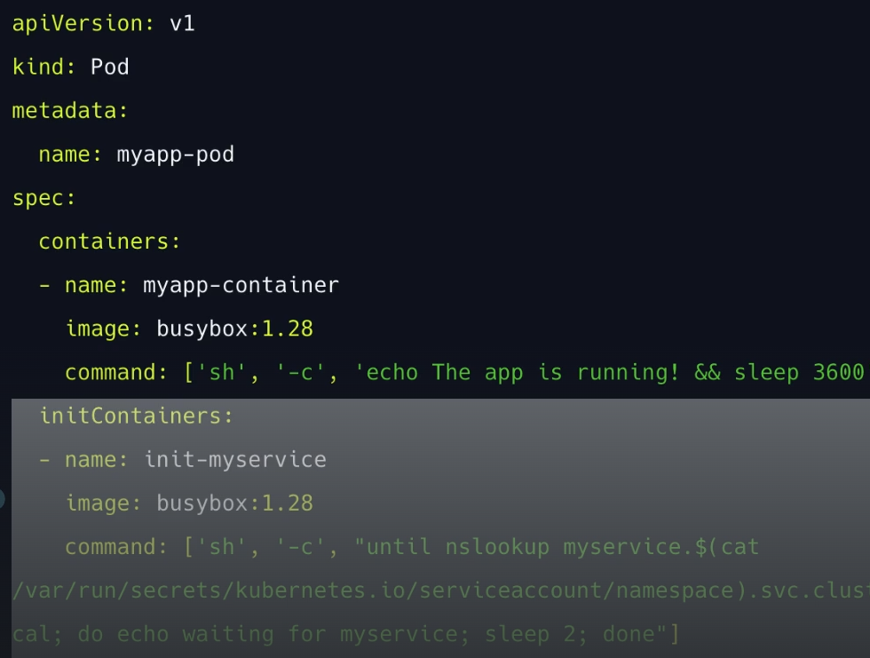

### Sidecar containter ###
Skrypt na kontenerze działa nonstop Side-By-Side z głównym kontrolerem na tym samym podzie (ex. heapdump w fortee)

Wielekontenerw wewntrz jednego poda, są to kontenery pomocnicze, na których wykonywane są drobne zadania, skrypty, cronjoby, kontener który odpowaida za zbieranie logów celem odciązenia pracy głównego kontenera.

jest to dobre rozwiązanie bo bo kontenery w tym samym podzie nie potrzebuja sieci/service, komunikują sie na lokalhoscie.

To dodatkowy kontener w Podzie, który współdzieli wolumen z główną aplikacją.

Jego zadanie: np. zbierać logi i przekazywać je gdzieś dalej


### Init container ###
Działa tylko raz na początku, przy uruchomieniu poda. Główny kotener działa po zakończeniu procesu inicjowanego pzez "kontener pomocniczy"



```emptyDir``` jest tymczasowy — jeśli Pod zostanie usunięty lub przeniesiony, dane znikają.
Kontenery init zawsze działają do końca.
Każdy kontener init musi zostać pomyślnie ukończony przed rozpoczęciem kolejnego.
Jeśli kontener init Podu ulegnie awarii, kubelet wielokrotnie restartuje ten kontener init, aż do skutku. Jeśli jednak Pod ma wartość restartPolicyNever, a kontener init ulegnie awarii podczas uruchamiania tego Podu, Kubernetes traktuje cały Pod jako nieudany

Kontenery init muszą działać do końca, zanim Pod będzie gotowy; kontenery sidecar działają przez cały czas życia Poda

kontenery init uruchamiane są sekwencyjnie (musi zakończyć zadanie kontener init_1 aby mógł uruchomić sie init_2)
Uruchamiane sa jako pierwsze i koczą swoje działanie przed uruchomieniem głownego kontenera poda

kontenery onit nie obsługuja ```lifecycle, livenessProbe, readinessProbelub , startupProbe```
1. Kontenery init mogą zawierać narzędzia lub niestandardowy kod konfiguracji, których nie ma w obrazie aplikacj
2. Kontenery init mogą działać z innym widokiem systemu plików niż kontenery aplikacji w tym samym podzie
3.  kontenery init działają do końca przed uruchomieniem jakichkolwiek kontenerów aplikacji, oferują one mechanizm blokowania lub opóźniania uruchamiania kontenerów aplikacji (najpierw musi wykonać się init)
4.  ontenery init umożliwiają bezpieczne uruchamianie narzędzi lub niestandardowego kodu

```yaml
apiVersion: v1
kind: Pod
metadata:
  name: myapp-pod
  labels:
    app.kubernetes.io/name: MyApp
spec:
  containers:
  - name: myapp-container
    image: busybox:1.28
    command: ['sh', '-c', 'echo The app is running! && sleep 3600']
  initContainers:
  - name: init-myservice
    image: busybox:1.28
    command:
      - sh
      - -c
      - |
        until nslookup myservice.$(cat /var/run/secrets/kubernetes.io/serviceaccount/namespace).svc.cluster.local; do
          echo waiting for myservice
          sleep 2
        done
  - name: init-mydb
    image: busybox:1.28
    command:
      - sh
      - -c
      - |
        until nslookup mydb.$(cat /var/run/secrets/kubernetes.io/serviceaccount/namespace).svc.cluster.local; do
          echo waiting for mydb
          sleep 2
        done

```
Podczas uruchamiania Poda, kubelet opóźnia uruchomienie kontenerów init, dopóki sieć i pamięć masowa nie będą gotowe. Następnie kubelet uruchamia kontenery init Poda w kolejności, w jakiej występują w specyfikacji Poda.

Zmiany w specyfikacji kontenera init ograniczają się do pola obrazu kontenera. Bezpośrednia zmiana imagepola kontenera init nie powoduje ponownego uruchomienia Poda ani jego ponownego uruchomienials
