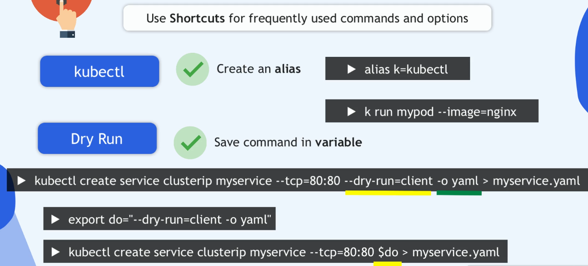
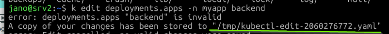
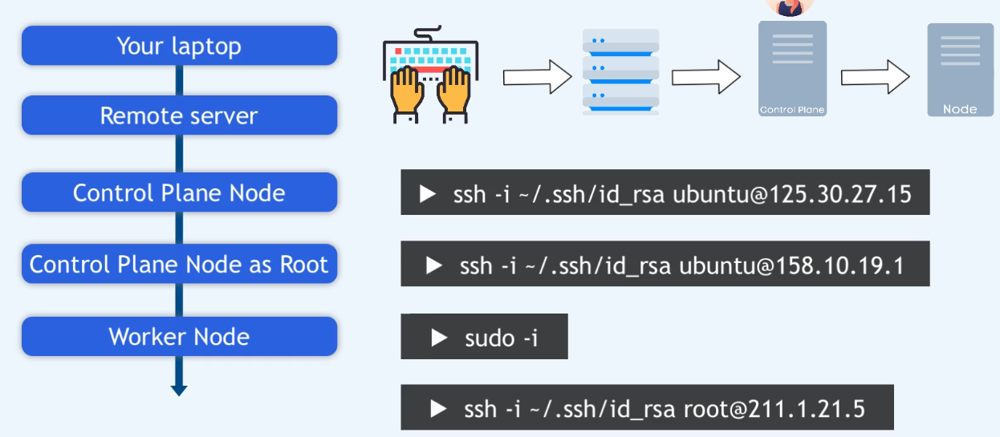

1. na pami wszystkie imperative commennd tak aby można było stworzyć plik yaml i następnie go przerobić
tez da sie robić to z rbac

|command|description|
|---|---|
|clusterrole|           Create a cluster role|
|clusterrolebinding|    Create a cluster role binding for a particular |cluster role|
|configmap|             Create a config map from a local file, directory or literal value
|cronjob|               Create a cron job with the specified name
|deployment|            Create a deployment with the specified name
|ingress|               Create an ingress with the specified name
|job|                   Create a job with the specified name
|namespace|             Create a namespace with the specified name
|poddisruptionbudget|   Create a pod disruption budget with the specified name
|priorityclass|         Create a priority class with the specified name
|quota|                 Create a quota with the specified name
|role|                  Create a role with single rule
|rolebinding|           Create a role binding for a particular role or cluster role
|secret|                Create a secret using a specified subcommand
|service|               Create a service using a specified subcommand
|erviceaccount|        Create a service account with the specified nme
|      token|                 Request a service account token
---  
 Start a nginx pod
  kubectl run nginx --image=nginx

   Start a hazelcast pod and let the container expose port 5701
  kubectl run hazelcast --image=hazelcast/hazelcast --port=5701

   Start a hazelcast pod and set environment variables "DNS_DOMAIN=cluster" and "POD_NAMESPACE=default" in the
container
  kubectl run hazelcast --image=hazelcast/hazelcast --env="DNS_DOMAIN=cluster" --env="POD_NAMESPACE=default"

   Start a hazelcast pod and set labels "app=hazelcast" and "env=prod" in the container
  kubectl run hazelcast --image=hazelcast/hazelcast --labels="app=hazelcast,env=prod"

   Dry run; print the corresponding API objects without creating them
  kubectl run nginx --image=nginx --dry-run=client

   Start a nginx pod, but overload the spec with a partial set of values parsed from JSON
  kubectl run nginx --image=nginx --overrides='{ "apiVersion": "v1", "spec": { ... } }'

   Start a busybox pod and keep it in the foreground, don't restart it if it exits
  kubectl run -i -t busybox --image=busybox --restart=Never

   Start the nginx pod using the default command, but use custom arguments (arg1 .. argN) for that command
  kubectl run nginx --image=nginx -- <arg1> <arg2> ... <argN>

   Start the nginx pod using a different command and custom arguments
  kubectl run nginx --image=nginx --command -- <cmd> <arg1> ... <argN>
---

2. komendy typu uruchom a nie tórz yamla `k run myapp --image-nginx:1.24`
3. alias dla kubectl `alias k=kubectl`

4. jeśli źle zmienisz dane w deploymencie poprzez `k edit` i dane sie nie zapisza,(zmiana nei zistanie wdrożona), to dane są zapisywane w temp file. 

czyli można zrobić `k apply -f /tmp/kubectr-edit...yaml`

k scale deployment -n test test --replicas=3

### wszystki workery
`kubectl get nodes -l '!node-role.kubernetes.io/control-plane'`
### niedziałające workerey
`kubectl get nodes -l '!node-role.kubernetes.io/control-plane' --field-selector=status.phase!=Running`
kubectl get nodes -l '!node-role.kubernetes.io/control-plane'|grep -i '!Ready'
  
### tylko controlplane
`kubectl get nodes -l 'node-role.kubernetes.io/control-plane'`
### tyko działające workery
`kubectl get nodes -l '!node-role.kubernetes.io/control-plane' --field-selector=status.phase=Running`

wyświetlaj pody, które mają ustawiony żądanie zasobów
[pody na worker 1]

sprawd co jest w komendzie top
`k top pod -n argocd argocd-application-controller-0 --container`

szybszy dostęp do zasobów danego namespace. ustawiasz defaultowy ns na kótym bedziesz pracował.
`k config set-context --current --namespace=xxx`

na nodach nie pracujesz jako root, pamietajo `sudo apt install`, `sudo -i`

sessiotn switches - sprawdzaj na jakim serwerze sie znajdujesz
`ssh -i /.ssh/id_rsa ubuntu@125.30.27.15`

Egzamin dotyczy tworzenia zasobw k8s ale występuja równiez odpowiedzi tekstowe. 
Plik bedzie utworzony w twoim środowisku ale musisz czytać uwaznie bo plik może być na konkretnym środowisku lib noddzie.
na egzaminie będę miał do czynienia z wieloma klastrami, nie tylko z jednym; przy pytaniu powinieneś miec komędę umożliwiająca przeskoczenie na właściwy klaster `k config use-context ...`
upewnij sie jeże jesteś na  środowisku gdzie dostępny jest konkretny `kueconfig` umożliwiający dostęp do `clustr context`

Dostępne zasoby poczas egzaminu to oficjalna dokumentacja k8s
backup, restore cluster, ale nie ma potrzeby tworzyć clustra os zera.
manifert file of controlplane, kubecoonfig on control plane

powtrzy jak tworzone s certyfikaty, odnawiane, ich lokalizacja

`kubectl config view --kubeconfig=/etc/kubernetes/controller-manager.conf`

