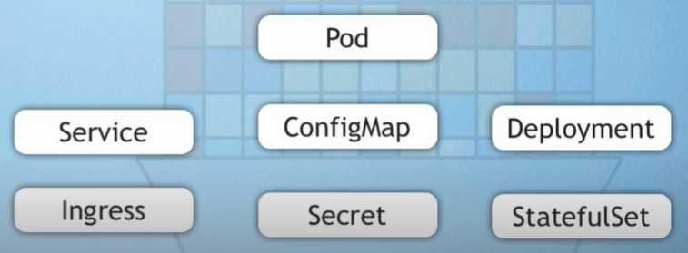

## Helm
Helm jest menedżerem pakietów dla Kubernetes, który ułatwia zarządzanie aplikacjami i ich wdrażaniem na klastrze Kubernetes. Helm działa na zasadzie tzw. chartów (pakietów konfiguracyjnych), które zawierają wszystkie potrzebne pliki YAML, szablony i konfiguracje umożliwiające łatwe wdrażanie, aktualizowanie oraz usuwanie aplikacji.

###### Podstawowe pojęcia
```Chart```: Pakiet konfiguraczyjny Helm, który zawiera definicję aplikacji, a także wszystkie zależności i szablony konfiguracji (np. deploymenty, serwisy, config mapy).

```Release```: Instancja charu wdrożona w klastrze. Każde wdrożenie Helm tworzy nowy „release”, który ma swoją unikalną konfigurację i historię.

```Repository```: Zbiór chartów, który działa podobnie jak repozytorium kodu – przechowuje i udostępnia różne wersje aplikacji, gotowe do zainstalowania.

Helm umożliwia automatyzację procesu wdrażania aplikacji, tworząc, aktualizując i usuwając zasoby Kubernetes w sposób kontrolowany i powtarzalny.


```sh
ex.
helm install my-release-name stable/nginx
helm upgrade my-release-name stable/nginx
helm uninstall my-release-name
```


Helm Chart = zestaw plików YAML, które umożliwaiją storzenia applikaci na pwodstawie tego co już ktoś kiedyś utowrzył i opublikował.



Jeśli chesz odszukać jakąś aplikacje w menadźerze pakietów helm (prometheus-community)
```sh
helm search repo prometheus-community
```
lub odwidź URL: https://artifacthub.io/

##### Templating Engin
Mechanizm, który pozwala na dynamiczne generowanie plików konfiguracyjnych w oparciu o szablony.

###### Zalety Templating Engine w Kubernetes:
Zmienność i elastyczność: Możemy tworzyć jeden szablon, który dostosowuje się do różnych środowisk (np. różne wartości w środowisku produkcyjnym i deweloperskim).

Reużywalność: Dzięki szablonom możemy łatwo ponownie używać kodu w różnych aplikacjach lub usługach.

Łatwiejsze zarządzanie konfiguracjami: Można zdefiniować domyślne wartości w szablonach, które można modyfikować podczas instalacji lub aktualizacji aplikacji.

Automatyzacja: Zamiast ręcznie edytować długie i złożone pliki YAML, można używać szablonów, które automatycznie dostosowują się do potrzeb aplikacji.


##### App Accross different environtment
Gdy potzebujesz wdrożyć tę sama aplikacje w różnych ścodowiskach (prod, stage, dav), możesz spakować ją do własnego ```charta``` a następnie redployować ją na różnych klastrach.

---
Co znajduje się w Helm Charcie:


---
Aby używać Helm, należy go najpierw zainstalować.
URL: https://helm.sh/docs/intro/install/

From Apt (Debian/Ubuntu)
```sh
curl https://baltocdn.com/helm/signing.asc | gpg --dearmor | sudo tee /usr/share/keyrings/helm.gpg > /dev/null
sudo apt-get install apt-transport-https --yes
echo "deb [arch=$(dpkg --print-architecture) signed-by=/usr/share/keyrings/helm.gpg] https://baltocdn.com/helm/stable/debian/ all main" | sudo tee /etc/apt/sources.list.d/helm-stable-debian.list
sudo apt-get update
sudo apt-get install helm
```
