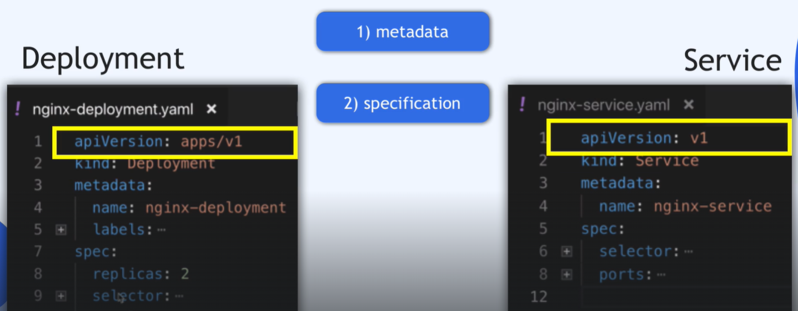
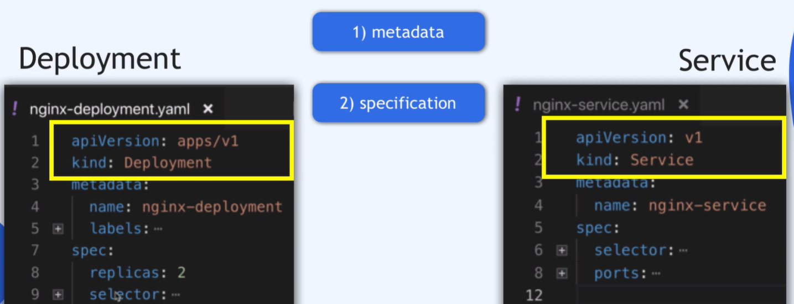
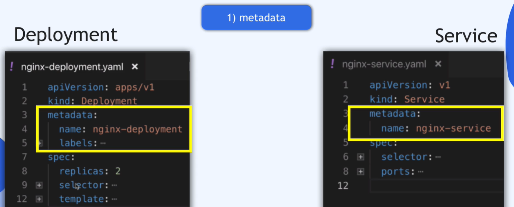
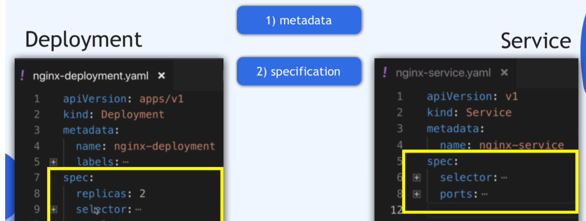

Kazdy z Configuration Files *.yaml (kubernetes manifest) posiada trzy podstawowe poziomy.
z racj tego iż jest to plik YAML i wszelkie przesunięcia nawet jednej spracji są dla niego istotne, warto po ztworzeniu manifestu sprawdzić czy plik nie zawiera bęłdów używająć https://www.yamllint.com/

Istniejeą różne rodzaje wersji dla róznych kmponentów.

Deklaracja co chesz wdrożyć, deployment czy service

1. metadata

2. specyfication - atrybuty będą specyficzne dla każdego z komponentu (deployment, dervice, ..)

3. Status - jest automatyczne gendrowany i dodawany przez k8s
   
   Aktualny stan nie musi być taki sam jak stan zadeklaroway. 
   
   Specyfication może zawierać informacje o 2 replikach a w satus może wskazywać że istnieje tylko jedna. Znaczy to, że jest jakiś problem i k8s będzie doążył do tego aby były 2 repliki - jak w spec.
   
   Informacje dotyczące statusu przekazywane sa prze [ETCD](../02-architecture/02-master_.md) 

Dobrą proktyką jest przechowywanie Configuration File w Git lub Infrastructure as a Code