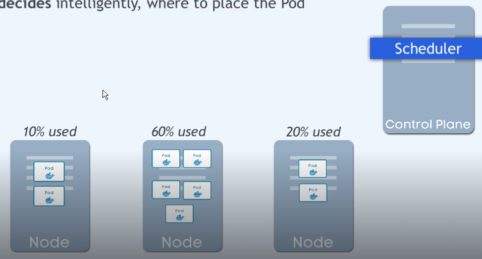
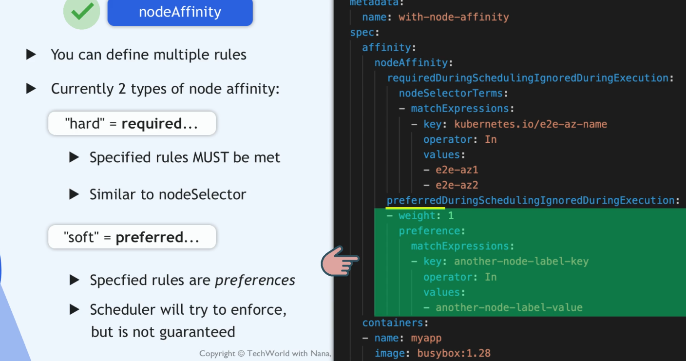
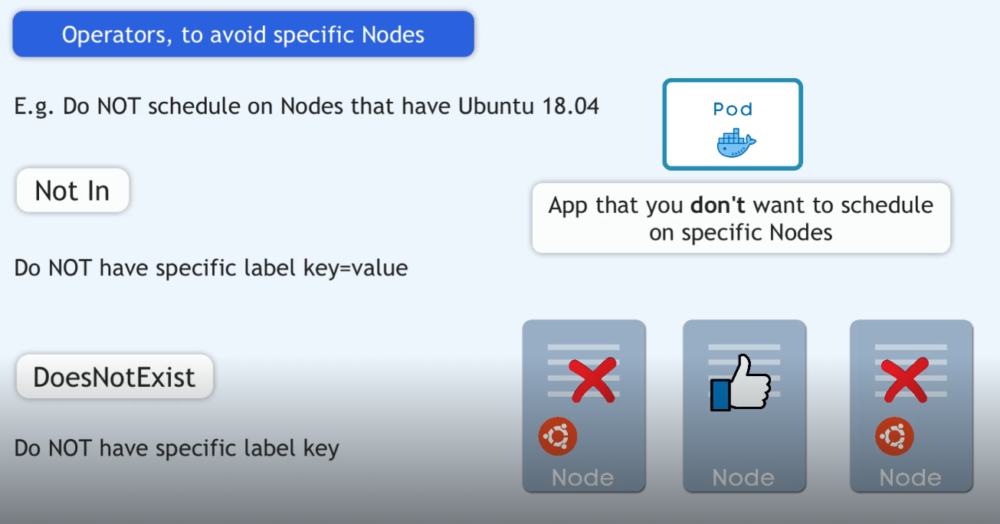

jak przypisapoda do noda (k8s nie ma tego robić automatycznie)


etcd przchowuje informacje o tym jakie zasoby (pody) są na danym nodzie klastra, scheduler zbiera te informacje i umożliwia uruchomieneie poda na nodzie, który jest najmniej obciążony.

# nodeName
`nodeName: k8s-worker1` przypisujesz poda do konkretnego noda - na sztywno, bez wzdlęd na to czy nod ma wystarczającz zasoby, omija scheduling.
 używaj tylko przy statycznej nazwie nodów (inaczej pod nie uruchomi sie po restarcie noda - dynamiczne przydzielane nazw w eks).

# nodeSelector
 `k label nodes k8s-worker1 type=cpu` pozwala nadać label na działającym organiźmie. używany gdy nazwy nodówa przypisywane są dynamicznie

```bash
 nodeSelector:
     type: cpu
```     
`nodeSelector` umożliwia przypisane poda, deploymentu do nodów zawierających odpowiedni label. możesz użyć kokretnego regionu lub AZ dla deploymentu poda. Innymi sowy jeśli node ma określony label tożsamy z selektorem poda, to poda to `schedulrer` uruchomi pod na tym kotnkretnym nodzie.

# nodeAffinity
`nodeAffinity` jest bardziej elastyczny dla tworzenia poda ale za to bardziej skomplikowany dla tworzenia manifestu.
Daje możliwość definiowania wielu ról, wyrażeń



w przypadku 'requiredDuringShedukkung.nodeSelectorTerms.operator' istnieje kilka opcji: in, Not In, Exists, DoesNotExist Gt, Lt

|operator|opis|
|-----|----|
|In      |The label value is present in the supplied set of strings|
|NotIn	|The label value is not contained in the supplied set of strings|
|Exists  |A label with this key exists on the object|
|DoesNotExist|	No label with this key exists on the object|
|Gt  |The field value will be parsed as an integer, and that integer is less than the integer that results from parsing the value of a label named by this selector|
|Lt  |The field value will be parsed as an integer, and that integer is greater than the integer that results from parsing the value of a label named by this selector|

możemy wskazać na jakich nodach pody ie powinny się uruchomić.



nodeName
nodeSelector
nodeAffinity
podeAffinity

# taints and tolleration
`taints` - oznaczenie noda jako nieodpowiedniego dla poda

`tolerations` - oznaczenie poda jako odpowiedniego do uruchomienia na nodzie z `taintem`

taints i tolerations współpracują ze sobą aby zapobiec uruchomieniu poda na nieodpowiednim nodzie.
taints są dodawane do nodów
```bash
kubectl taint nodes k8s-worker1 key=value:NoSchedule
```
tolerations są dodawane do poda
```bash
tolerations:
- key
  operator: "Equal"
  value: "value"
  effect: "NoSchedule"
```
jeśli nod ma taint to pod bez odpowiedniej toleration nie zostanie na nim uruchomiony.
# Pod Scheduling
Pod Scheduling to proces przypisywania Podów do odpowiednich węzłów (Nodes) w klastrze Kubernetes. Scheduler analizuje dostępne zasoby i wymagania Podów, aby znaleźć najlepsze dopasowanie.
Scheduler bierze pod uwagę różne czynniki, takie jak:
- Zasoby węzłów (CPU, pamięć)

|Mechanizm|Co robi|
|---------|-------|
tolerations| pozwala wejść na node z taintem
nodeSelector| wymusza wybór noda
nodeAffinity| precyzyjny wybór noda

manifest (toleration + nodeSelector)
```sh
apiVersion: v1
kind: Pod
metadata:
  name: nginx-master
spec:
  tolerations:
  - key: "node-role.kubernetes.io/control-plane"
    operator: "Exists"
    effect: "NoSchedule"
  nodeSelector:
    node-role.kubernetes.io/control-plane: ""
  containers:
  - name: nginx
    image: nginx
```
alternatywa (lepsza): nodeAffinity
```sh
affinity:
  nodeAffinity:
    requiredDuringSchedulingIgnoredDuringExecution:
      nodeSelectorTerms:
      - matchExpressions:
        - key: node-role.kubernetes.io/control-plane
          operator: Exists
```

# `scheduler` unika `tait`, jeśli nie musi

za ustawienie taint na nodzie odpowiada kubeadm

 


