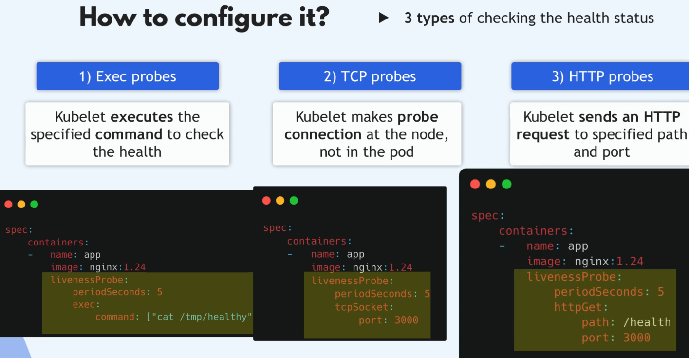
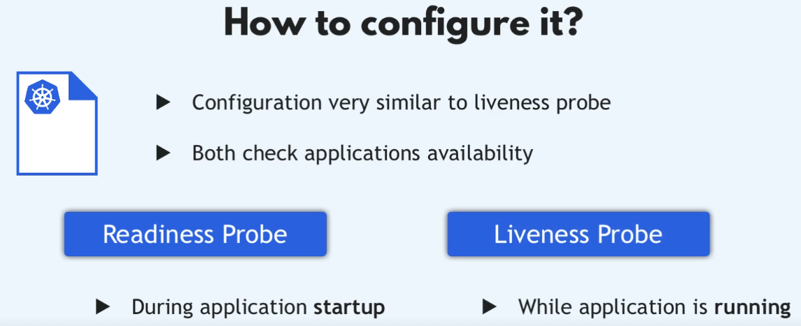

Cecha / Właściwość	|Liveness Probe	|Readiness Probe
----------------|----------------|----------------
Cel	|Sprawdza, czy aplikacja żyje / nie zawiesiła się	|Sprawdza, czy aplikacja jest gotowa do obsługi ruchu
Co pingujemy	|Endpoint aplikacji, port TCP lub komenda	|Endpoint aplikacji, port TCP lub komenda
Efekt w przypadku fail	|Kubernetes restartuje Poda	|Pod nie przyjmuje ruchu, ale nie jest restartowany
W relacji do Service	|Nie ma wpływu na routing ruchu (Pod może być wciąż w Service)	|Decyduje o tym, czy Pod jest w Service endpoints
Przykłady użycia	|Deadlock, memory leak, aplikacja “zamrożona”	|Pod inicjalizuje się (np. łączy z bazą danych), jeszcze nie obsługuje ruchu
Kiedy sprawdzamy	|Cały czas po starcie, np. co 10 sek	|Cały czas po starcie, np. co 10 sek
Typowa konfiguracja	|initialDelaySeconds, periodSeconds, failureThreshold	|initialDelaySeconds, periodSeconds, failureThreshold

# Podsumowanie
Liveness i Readiness Probes są kluczowymi mechanizmami w Kubernetes, które pomagają utrzymać zdrowie i dostępność aplikacji działających w klastrze. Liveness Probe monitoruje, czy aplikacja działa poprawnie i restartuje Poda w przypadku problemów, podczas gdy Readiness Probe określa, czy Pod jest gotowy do obsługi ruchu sieciowego.





```sh
spec:
  containers:
  - image: nginx:1.14.2
    name: liveness-readiness
    ports:
    - containerPort: 80
    readinessProbe:    # sprawdzanie czy pod jest gotowy do obslugi ruchu
      tcpSocket:
        port: 80
      initialDelaySeconds: 10   # czas do pierwszego sprawdzenia
      periodSeconds: 5          # co ile sekund sprawdzac
    livenessProbe:          # sprawdzanie czy pod jest "zywy", czy container dziala poprawnie, jesli nie to restartuje go
      tcpSocket:
        port: 80
      initialDelaySeconds: 15    # czas do pierwszego sprawdzenia
      periodSeconds: 20          # co ile sekund sprawdzac
```

