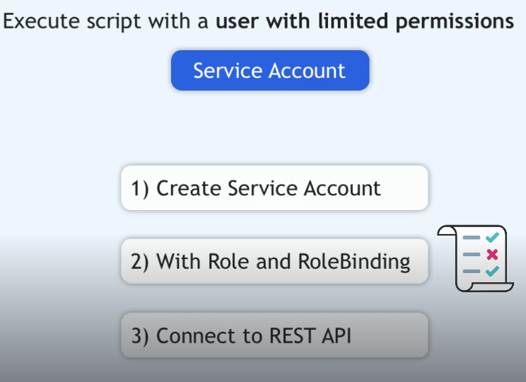
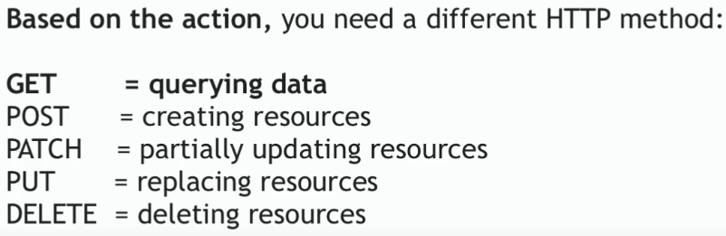
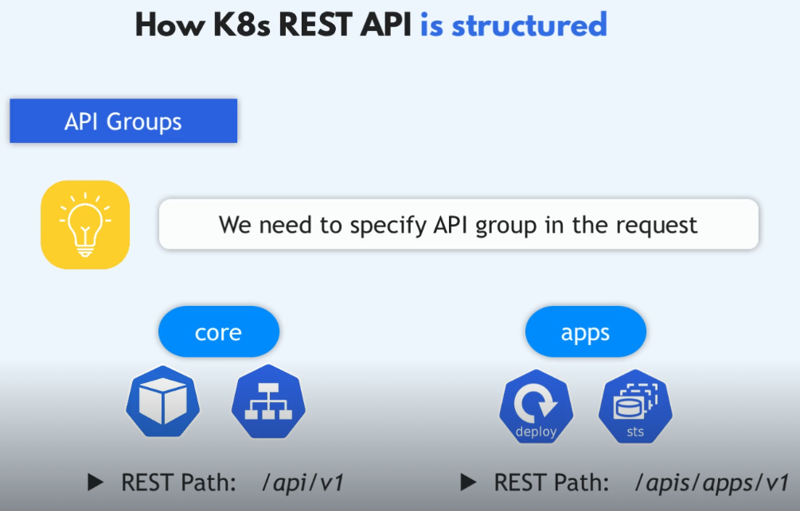
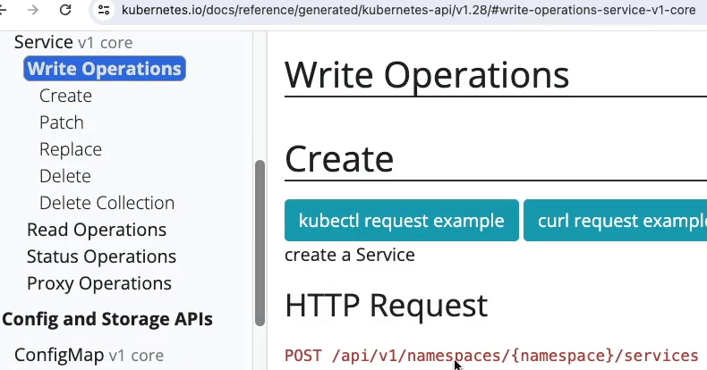

1. utwurz konto servisowe (imperative commend)
   `kubectl create serviceaccount myscript -n test-app`

```yaml
apiVersion: v1
kind: ServiceAccount
metadata:
  name: my-service-account
  namespace: test-app
```

`kubectl apply -f serviceaccount.yaml`


2. Nadanie uprawnień (RBAC) – to jest kluczowe

ServiceAccount domyślnie NIE ma praw.
```yaml
# Role
apiVersion: rbac.authorization.k8s.io/v1
kind: Role
metadata:
  name: pod-reader
  namespace: test-app
rules:
- apiGroups: [""]
  resources: ["pods"]
  verbs: ["get", "list", "watch"]
---
# RoleBinding
apiVersion: rbac.authorization.k8s.io/v1
kind: RoleBinding
metadata:
  name: pod-reader-binding
  namespace: test-app
subjects:
- kind: ServiceAccount
  name: my-service-account
  namespace: test-app
roleRef:
  kind: Role 
  name: pod-reader
  apiGroup: rbac.authorization.k8s.io
```

`kubectl apply -f role.yaml`
`kubectl apply -f rolebinding.yaml` 

3. Użycie ServiceAccount w Podzie / Deployment
```yaml
apiVersion: apps/v1
kind: Deployment
spec:
  template:
    spec:
      serviceAccountName: my-service-account
      containers:
      - name: app
        image: nginx
```

Token ServiceAccount
sekrety z tokenem NIE są tworzone automatycznie
używa się TokenRequest API

Wygenerowanie tokenu
`kubectl create token my-service-account -n test-app`

Token:
- ma TTL
- jest bezpieczniejszy
- zalecany do API access

5. Sprawdzenie, czy działa (impersonation)
`kubectl auth can-i list pods --as=system:serviceaccount:my-namespace:my-service-account -n test-app`

6. Najczęstsze błędy !!! (czesto na egzaminie)
Błąd	Skutek
Brak RoleBinding	403 Forbidden
Zły namespace	brak dostępu
ClusterRole zamiast Role	zbyt szerokie uprawnienia
Brak serviceAccountName w Podzie	używany default SA

---
# Dostęp dla jenkins
```yaml
apiVersion: v1
kind: ServiceAccount
metadata:
  name: jenkins
  namespace: cicd
---
apiVersion: rbac.authorization.k8s.io/v1
kind: ClusterRole
metadata:
  name: jenkins-role
rules:
# Namespace lifecycle (kluczowe dla Twojego use-case)
- apiGroups: [""]
  resources: ["namespaces"]
  verbs: ["create", "get", "list", "watch", "delete"]

# Core workload resources
- apiGroups: [""]
  resources:
    - pods
    - pods/log
    - services
    - endpoints
    - persistentvolumeclaims
    - configmaps
    - secrets
  verbs: ["get", "list", "watch", "create", "delete", "patch", "update"]

# Apps / controllers
- apiGroups: ["apps"]
  resources:
    - deployments
    - replicasets
    - statefulsets
    - daemonsets
  verbs: ["get", "list", "watch", "create", "delete", "patch", "update"]

# Batch jobs (migrations, init jobs, itp.)
- apiGroups: ["batch"]
  resources: ["jobs", "cronjobs"]
  verbs: ["get", "list", "watch", "create", "delete", "patch", "update"]

# Ingress (aktualne API)
- apiGroups: ["networking.k8s.io"]
  resources: ["ingresses"]
  verbs: ["get", "list", "watch", "create", "delete", "patch", "update"]

# (opcjonalnie) Events – przydatne do debugowania pipeline
- apiGroups: [""]
  resources: ["events"]
  verbs: ["get", "list", "watch"]
---
apiVersion: rbac.authorization.k8s.io/v1
kind: ClusterRoleBinding
metadata:
  name: jenkins-rolebinding
subjects:
- kind: ServiceAccount
  name: jenkins
  namespace: cicd
roleRef:
  kind: ClusterRole
  name: jenkins-role
  apiGroup: rbac.authorization.k8s.io

```


aby powiązać wszystkie obiekry, należy jesczcze utworzyć secret

```yaml
apiVersion: v1
kind: Secret
metadata:
  name: cluster-access-secret
  namespace: cicd
  annotations:
    kubernetes.io/service-account.name: jenkins # This annotation is required to link the secret to the service account
type: kubernetes.io/service-account-token
```
sprawdź, czy wszystko zostalo powiąane i token został wygenerowany
`k describe sa -n cluster-access serviceaccount`

wyśwwitl token, skopiuj go (jest zakodowany)
`k get secrets -n cluster-access cluster-access-secret -o yaml`

w jankis musisz podać zdekowdowany token
`k get secret cluster-access-secret -n cluster-access -o jsonpath='{.data.token}'| base64 -d`


clusterrole jest zasobem globalnym 
`kubbectl get clusterrole`
`k describe clusterroles.rbac.authorization.k8s.io jenkins-role`
`kubectl get clusterrolebinding |grep   `

przetestuj z poziomu `control-plane`
`curl -X GET $SERVER/api --header "Authorization: Bearer $TOKEN" --cacert /etc/kubernetes/pki/ca.crt`




