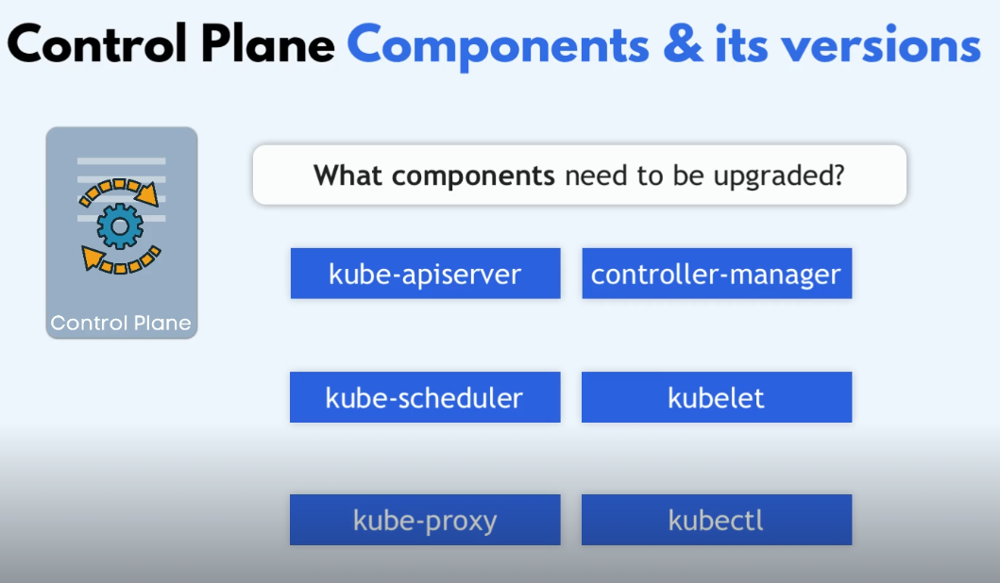
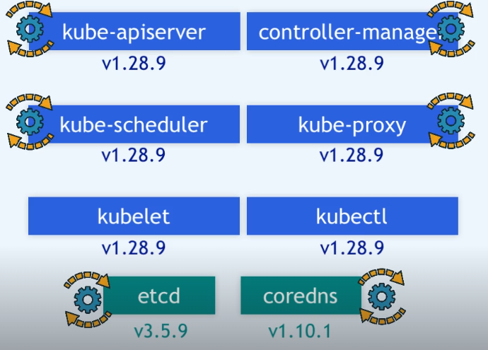

Są kompontnty jak CILIUM które byłky doinstalowywane do klastra i nie zostaną automatycznie zktualizowane. Przed upgradem należy sptawdzić czy nowa wersja k8s obsuguje stare cilium, (dotyczy to wszystkich dodaktowych komponentów np.    )

podążaj za wskazwokami: https://v1-34.docs.kubernetes.io/docs/tasks/administer-cluster/kubeadm/kubeadm-upgrade/

1. wykonaj snapshot `etcd`
2. zaktualzuj pakiett repozytorium dla nowej wersji k8s, (usuń wpis dla starej wersji repozytorium)

### Control Plane Node
```sh
# conntest to controlplane node
ssh k8s-master 

sudo -i

nano /etc/apt/sources.list.d/kubernetes.list
deb [signed-by=/etc/apt/keyrings/kubernetes-apt-keyring.gpg] https://pkgs.k8s.io/core:/stable:/v1.34/deb/ /

apt-update
apt list --upgradable

# replace x in 1.34.x-* with the latest patch version
apt-mark unhold kubeadm && \
apt-get update && apt-get install -y kubeadm='1.34.4-1.1' && \
apt-mark hold kubeadm

# check the ver
kubeadm version

# veryfy the upgrade plan          
kubeadm upgrade plan

kubeadm upgrade apply v1.34.4

# dns of controlplane
kubectl drain k8s-master --ignore-daemonsets 

apt-mark unhold kubelet kubectl && \
apt-get update && apt-get install -y kubelet='1.34.4-1.1' kubectl='1.34.4-1.1' && \
apt-mark hold kubelet kubectl

systemctl daemon-reload
systemctl restart kubelet
systemctl status kubelet.service

kubectl uncordon k8s-master
```
w przypadku pozostałych controlplane (jeśli masz wiecej niż jeden), użyj polecenia `sudo kubeadm upgrade node` zamiast polecenia `sudo kubeadm upgrade apply`

### Worker Nodes
```sh

ssh k8s-worker1
sudo -i

nano /etc/apt/sources.list.d/kubernetes.list
deb [signed-by=/etc/apt/keyrings/kubernetes-apt-keyring.gpg] https://pkgs.k8s.io/core:/stable:/v1.34/deb/ /

apt-mark unhold kubeadm && \
apt-get update && apt-get install -y kubeadm='1.34.4-1.1' && \
apt-mark hold kubeadm

kubeadm upgrade node

kubectl drain k8s-worker1 --ignore-daemonsets --force

apt-mark unhold kubelet kubectl && \
apt-get update && apt-get install -y kubelet='1.34.4-1.1' kubectl='1.34.4-1.1' && \
apt-mark hold kubelet kubectl

systemctl daemon-reload
systemctl restart kubelet
systemctl status kubelet.service

kubectl uncordon k8s-worker1
```

3. 
---


1. Najpierw `kubeadm upgrade apply 1.33.0` - poleceie zaktulizuje control plain components (master), jak równeiż odnowi certyfikaty klastra (te z kołem zębatym
   
1. kublet i kubectl były instalowane osobno dla tego komponenty te musze być rowniez aktualizowane osobno
2. drain node
3.  upgrade kubelet i kubectl
4.  kubectrl uncordone k8s-master

następnie należy zaktualizowac workery
1. upgrade kubeadm
2. drain node
3. upgrade kubelet
4. uncordone node 
