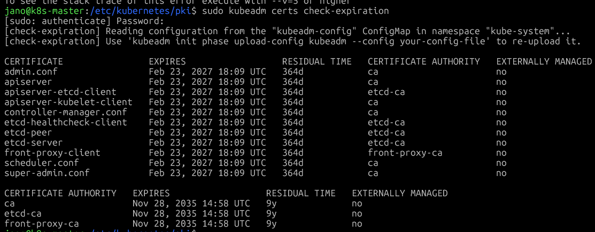

URL: https://kubernetes.io/docs/tasks/administer-cluster/kubeadm/kubeadm-certs/

certyfikaty przechowywane są na w nodzie mastera, control-plane w lokalizacji `/etc/kubernetes/pki`

aby sprawdzić czy ważność certyfikatów
```sh
kubeadm certs check-expiration
```
aby odnowić certyfikaty, wszystkie jednocześnie.
komenda muzi być wykonana na wszystkich mastrach (one-by-one)
```sh
kubeadm certs renew all
```



najlepszą praktyką jest regularne aktuaizowanie k8s co pozwoli na automatyczne odnawainie certyfikatów, bez których starcisz możliwość zasządzania klastrem