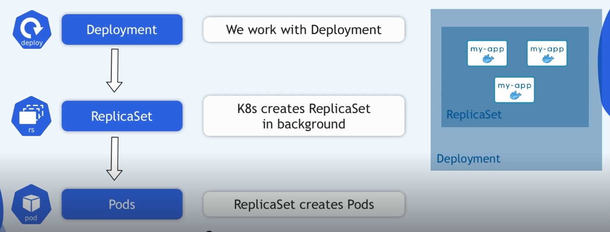
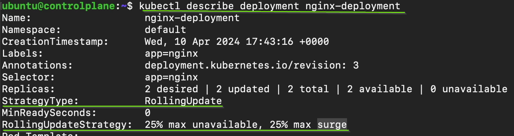
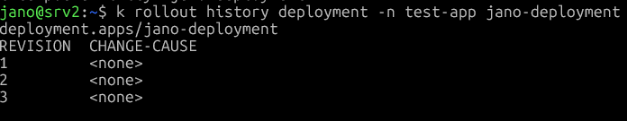

`kubectl get all -n namespace`

ReplicaSet - tworzona automatyczneie przy implementacji deploymentu

```sh
piVersion: apps/v1
kind: Deployment
metadata:
  name: nginx-deployment
  labels:
    app: nginx
spec:
  replicas: 2
  selector:
    matchLabels:
      app: nginx
  template:
    metadata:
      labels:
        app: nginx
    spec:
      containers:
      - name: nginx
        image: nginx:1.24
```        


## Deployment Startegies
1. recreate strategies - usówane są wszystkie stare pody, w tym samym czasie; a w ich miejsce tworzone nowe (customer outage)
2. rolling update strategy - domyślna strategia w k8s, usówa stary pod a w jego miejsce pojawia się nowy i tak dla wszystkich podow repliki.


### Rolling Update Strategy
```sh
spec:
    strategy:
        type: RollingUpdate
        rollingUpdate:
            maxSurge: 1          # ile dodatkowych podów może być utworzonych ponad zdefiniowaną liczbę replik
            maxUnavailable: 1    # ile podów może być niedostępnych podczas aktualizacji
```

Podczas aktualizacji deploymentu, Kubernetes będzie stopniowo usuwał stare pody i tworzył nowe, zgodnie z ustawieniami `maxSurge` i `maxUnavailable`. Na przykład, jeśli mamy 3 repliki i ustawimy `maxSurge` na 1 oraz `maxUnavailable` na 1, to podczas aktualizacji może być maksymalnie 4 pody (3 stare + 1 nowy) i co najmniej 2 pody będą dostępne w tym samym czasie.

```sh
spec:
    strategy:
        type: RollingUpdate
        rollingUpdate:
            maxSurge: 25%          # ile dodatkowych podów może być utworzonych ponad zdefiniowaną liczbę replik
            maxUnavailable: 25%    # ile podów może być niedostępnych podczas aktualizacji
```

maxSurge: 25% <br>
25% z 4 = 1 Pod <br>
Kubernetes może utworzyć maksymalnie 5 Podów w trakcie aktualizacji
Nowe Pody są uruchamiane zanim stare zostaną usunięte

maxUnavailable: 25%<br>
25% z 4 = 1 Pod<br>
Maksymalnie 1 Pod może być niedostępny w danym momencie rollout’u

#### Dobre praktyki
maxSurge - większa wartość = szybszy rollout, ale większe zużycie zasobów

maxUnavailable - niskie wartości dla systemów krytycznych (często 0)

W połączeniu z Readiness Probe RollingUpdate działa poprawnie i bez downtime

# Podsumowanie  
Rolling Update jest domyślną strategią aktualizacji w Kubernetes, która pozwala na stopniowe wprowadzanie zmian w aplikacjach bez przerywania ich działania. Dzięki parametrom `maxSurge` i `maxUnavailable`, administratorzy mogą kontrolować, jak wiele nowych podów może być tworzonych jednocześnie oraz ile podów może być niedostępnych podczas aktualizacji. 

`kubectl rollout history deployment nginx` - wyświetla historie rollout

`kubectl rollout history deployment nginx-deployment`

`kubectl rollout status deployment nginx-deployment`

`kubectl rollout undo deployment jano-deployment -n test-app` - powrót do wcześniejszej wersji deploymentu.

`kubectl rollout undo deployment jano-deployment -n test-app --to-revision=1` - powrót do pierwszej wersji




# ReplicaSet
Celem ReplicaSet jest utrzymanie stabilnego zestawu replik działających w dowolnym momencie. W związku z tym często służy on do zagwarantowania dostępności określonej liczby identycznych podów.

- tylko utrzymuje liczbę Podów
- nie zarządza wersjami
- nie wykonuje rolloutów

ReplicaSet NIE obsługuje strategii rollout (strategy, RollingUpdate).
Jest tworzony i zarządzany automatycznie przez Deployment.
Używamy Deployment do zarządzania ReplicaSetami i aktualizacjami aplikacji.
```
`kubectl get rs` - lista replicasetów
`kubectl describe rs {rs-name}` - szczegóły replicaset
`kubectl get pods --selector=app=nginx` - lista podów dla replicaset z etykietą app=nginx
`kubectl scale rs {rs-name} --replicas=5` - zmiana liczby replik w replicaset
`kubectl delete rs {rs-name}` - usunięcie replicaset (usuwa również powiązane pody)
```
RollingUpdate dostępne jedynie w Deployment, StatefulSet, DaemonSet.

To Deployment:
- tworzy ReplicaSety
- zarządza ich wersjami
- wykonuje RollingUpdate / rollback

      Rollback przywraca CAŁY `spec.template` (czyli obraz, env, probe itd.),ale `spec.replicas` NIE jest częścią rewizji rollout.


# HorizontalPodAutoscaler - HPA
mechanizm umożliwiający skalowanie podów w zależności od obciążenia.
- zmienia spec.replicas w Deployment
```yaml
apiVersion: autoscaling/v2
kind: HorizontalPodAutoscaler
metadata:
  name: frontend-hpa
spec:
  scaleTargetRef:
    apiVersion: apps/v1
    kind: Deployment
    name: frontend
  minReplicas: 3
  maxReplicas: 10
  metrics:
  - type: Resource
    resource:
      name: memory
      target:
        type: Utilization
        averageUtilization: 50
  - type: Resource
    resource:
      name: cpu
      target:
        type: Utilization
        averageUtilization: 60    
```
zasoby deklarowane są w deploymencie

```yaml
apiVersion: apps/v1
kind: Deployment
metadata:
  name: frontend
spec:
  replicas: 3
  template:
    spec:
      containers:
      - name: frontend
        image: my-image:latest
        resources:
          requests:
            memory: "500Mi"
            cpu: "2"
          limits:
            memory: "500Mi"
            cpu: "2"
```

`kubectl get hpa` - lista HPA<br>
`kubectl describe hpa {hpa-name}` - szczegóły HPA<br>
`kubectl delete hpa {hpa-name}` - usunięcie HPA<br>

Użyj `DaemonSet` zamiast `ReplicaSet` dla kontenerów, które zapewniają funkcję na poziomie maszyny, taką jak monitorowanie maszyny lub rejestrowanie jej.

Nazwa zestawu replik jest zawsze sformatowana jako `<DEPLOYMENT-NAME>-<HASH>` i jest podstawą dla tworzonych podów.

## Adoptowanie Podów przez ReplicaSet
Kubernetes nie zapobiega nakładaniu się etykiet ani selektorów, a jeśli wiele kontrolerów ma nakładające się selektory, mogą one powodować konflikty i nieoczekiwane zachowania.

ReplicaSet „adoptuje” Pody
- wyszukuje wszystkie istniejące Pody, które:
- pasują do spec.selector
- nie mają ownerReferences
- albo mają owner, który już nie istnieje
Jeżeli taki Pod istnieje - ReplicaSet może go adoptować.

Jeśli chcesz uniknąć adopcji istniejących Podów, upewnij się, że selektor ReplicaSet jest unikalny i nie pasuje do żadnych istniejących Podów w klastrze.

| Aspekt               | Horizontal Autoscaler (HPA)                                 | Vertical Autoscaler (VPA)                                                                                |
|---|---|---|
| **Zasada działania** | Dodaje lub usuwa repliki podów                              | Zmienia zasoby pojedynczego poda (CPU, pamięć)                                                           |
| **Skalowanie**       | Poziome (więcej instancji)                                  | Pionowe (więcej zasobów na instancję)                                                                    |
| **Przykład**         | Aplikacja webowa z rosnącym ruchem – dodawanie nowych podów | Aplikacja bazodanowa z dużym zapotrzebowaniem na pamięć – zwiększanie pamięci i CPU w istniejącym podzie |
| **Zalety**           | Łatwe skalowanie w poziomie, lepsza dostępność              | Optymalizacja wykorzystania zasobów, brak konieczności dodawania nowych instancji                        |
| **Wady**             | Może zwiększać koszty poprzez dodawanie wielu podów         | Może wymagać restartu poda, mniej elastyczne w przypadku bardzo dynamicznego ruchu                       |


Horizontal Autoscaler (HPA):
- Aplikacja webowa: Gdy ruch wzrasta, HPA automatycznie dodaje więcej podów, aby rozłożyć obciążenie.

Vertical Autoscaler (VPA):
- Baza danych: Gdy zapotrzebowanie na pamięć lub CPU rośnie, VPA zwiększa zasoby istniejącego poda, zamiast dodawać nowe instancje.