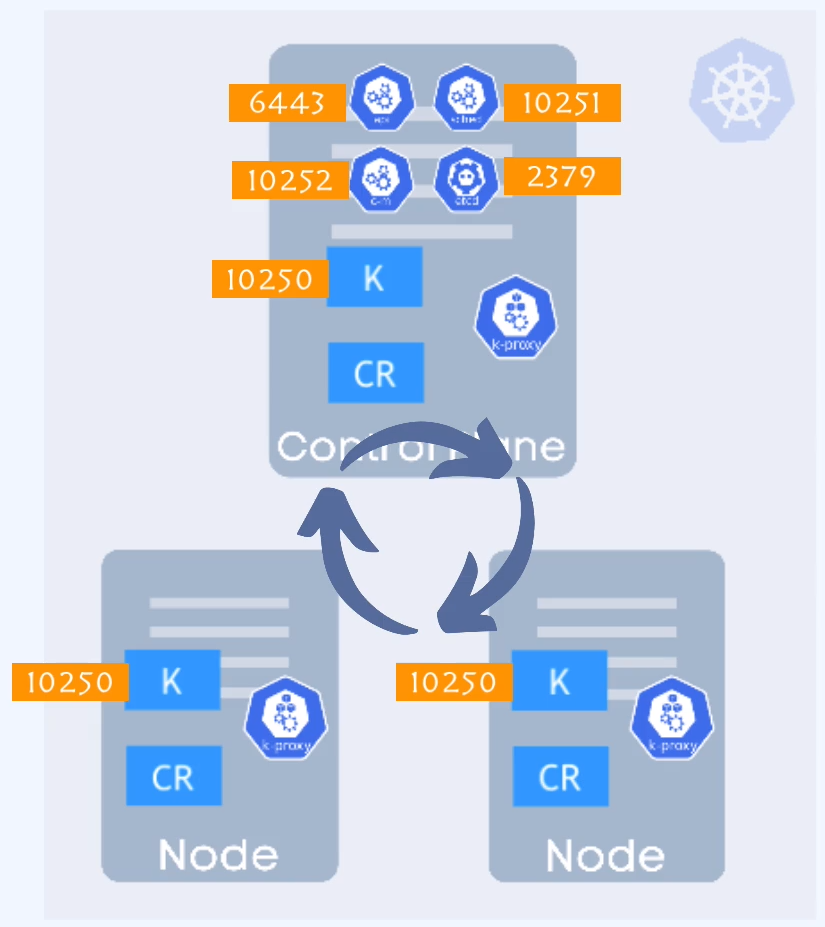
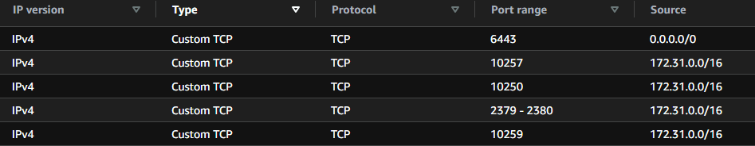
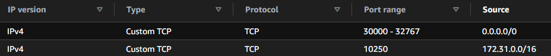
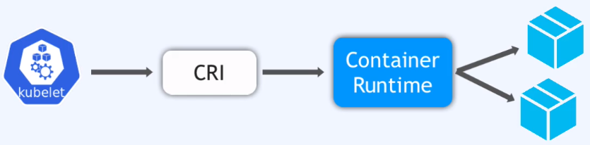
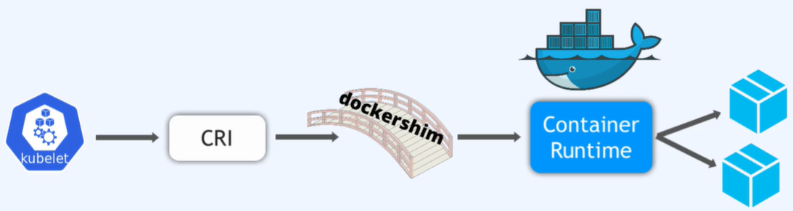
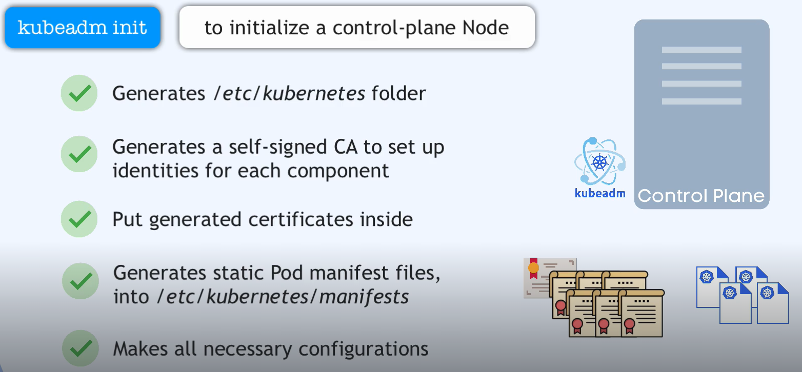
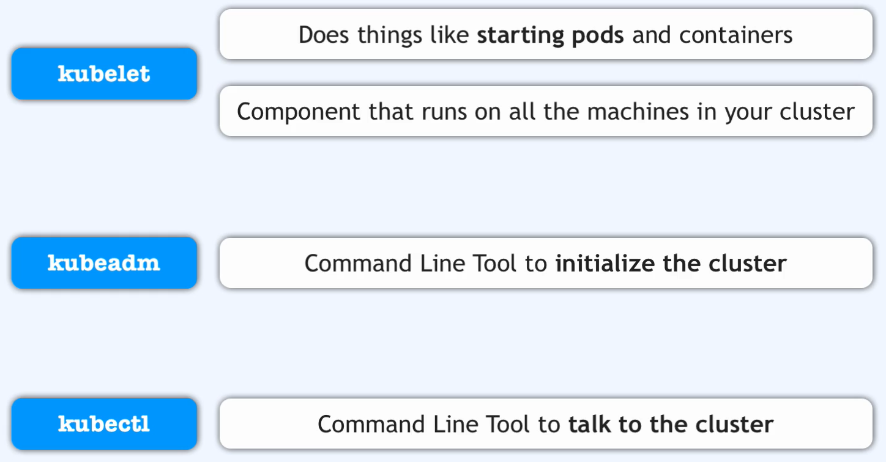

Postępuj zgodnie z dokumentacją [kubeadm](https://kubernetes.io/docs/setup/production-environment/tools/kubeadm/install-kubeadm/)


1. Otwórz porty na poziomie security group [required ports](https://kubernetes.io/docs/reference/networking/ports-and-protocols/)
   osobna lista portów dla mastera, osobna dla workera.
   


k8s-master-SG


k8s-worker-SG


2. utwórz nody mastera oraz workera (pamiętaj o minimalnych wymaganiach nodow klastra k8s).

---Master
1x t3.medium
---Worker
2x t3.medium

3. wyłacz swap (dotyczy mastera i workera)

```bash
sudo swapoff -a
```
4. podepnij odpowiednie security groupy do nodów

5. nazwij nody, odpowienio

```bash
sudo hostnamectl set-hostname "master/worker"
exec bash
```

6. Dotyczy mastera i workerów (spełnia walory estetyczne, bprzejżyste zarządzanie klasterm).
Można pominąć ten krok używająć domyślnych nazw systemu. (hostname ip-10-20-10-56)
Fakt, iż k8s używa cetyfikatów do komunikacji, muszą być wykożystywane nazwy a nie aderesy ip nodów.

```bash
echo "10.20.10.56 master" >> /etc/hosts
echo "10.20.10.129 worker1" >> /etc/hosts
echo "10.20.10.182 worker2" >> /etc/hosts
```

7. zainstaluj Container Runtime
Nie jest komponentem k8s. ContainerRuntime jest osobna aplikacja, którą k8s uzywa do planowania kontenerów.
CRI - Container Runtime Interface, to zestaw ról jak container runtime musi zaimplementować. 
sprawdź [container runtime](../01-core-concepts/02-architecture/01-worker_.md)
Za pomoca interwejsu kubelet jest w stanie rozmawiać s conteiner runtime aby zaplanować kontenery, pobrać obrazy, ...



Docker nie implementuje ról CRI
k8s dodał poziom dockershim (GW), aby wspierać Docker.
dockershim umożliwia kublet rozmowe z docker, używając API CRI i jest częścią kodu k8s.



k8s nie wspiera już Docker runtime (od wersji 1.22)
dla tego inne kontenery stały się bardziej popularne (cri-o, containerD)

Docker był peirwszym, najbardziej popularnym środowiskiem uruchamiania kontenerów.
jest uzywany do budowy obrazów Docker

obecnie containerD jest czołowym środowiskiem uruchamiania kontenerów.

przejd do strony [Container Runtime](https://kubernetes.io/docs/setup/production-environment/container-runtimes/)


8. utwurz plik konfiguracyjny dka kubernetes (wykonaj dla mastera i workera)
jest to konfiguracja sieci dla interfejsu środowiska uruchomieniowego kontenera.
ide jest to aby wsszystki nody k8s mogły łączyć się ze sobą

```bash
cat <<EOF | sudo tee /etc/modules-load.d/k8s.conf
overlay
br_netfilter
EOF

sudo modprobe overlay
sudo modprobe br_netfilter

# sysctl params required by setup, params persist across reboots
cat <<EOF | sudo tee /etc/sysctl.d/k8s.conf
net.bridge.bridge-nf-call-iptables  = 1
net.bridge.bridge-nf-call-ip6tables = 1
net.ipv4.ip_forward                 = 1
EOF

# Apply sysctl params without reboot
sudo sysctl --system
```
9. instalacja containerD
przejdź do strony [ContainerD]https://github.com/containerd/containerd/blob/main/docs/getting-started.md
ConatainerD nie jest procesem kubernetsa, jest zewnetrznym procesem należącym do Dokera

na stronie przejdź do opcji 2 (zostaniesz przeniesiony dos trony docker)

```bash
sudo apt update
sudo apt install containerd
```
 wróc do strony [ContainerD]https://github.com/containerd/containerd/blob/main/docs/getting-started.md
 przejdź do sekcji Advanced topics

 /etc/containerd/confg.toml - containerd plik konfiguracyjny (procesów?)

 ```bash
 sudo mkdir /etc/containerd
 containerd config default |sudo tee /etc/containerd/config.toml
 ```

 wróć do dokumentacji k8s
 odszukaj sekcji Config the systemd cgroup drive
```bash
 sudo nano /etc/containerd/config.toml
```

odszukaj sekcję containerd.runtimes.runc.option, zmień wartość na true 

```C
  [plugins."io.containerd.grpc.v1.cri".containerd.runtimes.runc.options]
    SystemdCgroup = true
```
!!! Użyj skryptu aby zainstalować containerD pomijajac kroki powużej 
[install-containerd.sh](../02-build-cluster/install-containerd.sh) !!!

skrypt rozwiązuje wszystkie problemy od pkt.8
--- utwórz ec2, a następnie uruchom skrypt.

10. zainstaluuj kubeadm na każdym z nodów (master/worker)

kubeadm init - podnosi range noda do mastere (control plain)
komenda wykonywana jest tylko raz i na serwerze który ma być masterem.
komenda tworzy /etc/kuberentes. Wewnąrz folderu tworzone sa katalogi i pliki certyfikatór, katalo i plik manifestu k8s, ...


---tzn. utwórz ec2, a następnie uruchom skrypt--- 

zainstaluuj kubeadm na każdym z nodów (master/worker)

kubeadm init - podnosi range noda do mastera (control plain)
komenda wykonywana jest tylko raz, na serwerze, który ma być masterem.
komenda tworzy:
  - /etc/kuberentes/ -głowny katalog klastra
  - /etc/kubernetes/ca/ - katalog w którym przechowywane będą certyfikaty
  - /etc/kubernetes/manifest/ - znajdziesz tutaj mnifest klastra
    kublet odnajduje plik manifestu i uruchamia pod z suffixem nazwy serwera.
    na podstawie pliku manifest, kublet odpytuje containerD runtime o obrazy aplikacji jakie maja zostać zaimplementowane w kalastrze a następne tworzone są wymagane kontenery.


Przed zainicjowaniem master nose należy zainstalować kilka narzędzi ułatwiających zarządzanie klasterem.
## kubet, kubectl , bubeadm muszą być w tej samej wersji



Przejdz do strony  https://kubernetes.io/docs/setup/production-environment/tools/kubeadm/install-kubeadm/#installing-kubeadm-kubelet-and-kubectl


Zaktualizuj insex apt i zainstaluj pakiety za pomoca których stworzysz k8s klaster

```bash
sudo apt-get update
sudo apt-get install -y apt-transport-https ca-certificates curl gpg
```

utwórz katalog keyrings dla apt

```bash
sudo mkdir -m 755 /etc/apt/keyrings
```

pobierz klucz publiczny dla repozytorium kubernetesa

```bash
curl -fsSL https://pkgs.k8s.io/core:/stable:/v1.28/deb/Release.key | sudo gpg --dearmor -o /etc/apt/keyrings/kubernetes-apt-keyring.gpg
```

Dodaj repozytoriu do listy repozytoriów menadżera pakietów (apt).

```bash
echo 'deb [signed-by=/etc/apt/keyrings/kubernetes-apt-keyring.gpg] https://pkgs.k8s.io/core:/stable:/v1.28/deb/ /' | sudo tee /etc/apt/sources.list.d/kubernetes.list
```

Zktualizuj 'index apt' i zainstaluj kubelet kubeadm kubectl
instalowane będą w najnowszej, stabilnej, tej samej wersji.


```bash
sudo apt-get update
sudo apt-get install -y kubelet kubeadm kubectl
```

Zablokuj automatyczna aktualizację pakietów klastra
```bash
sudo apt-mark hold kubelet kubeadm kubectl
```

Jeśłi z jakiś pów należy zainstalować starszą wersje pakierów
```bash
sudo apt-get update
apt-cache medison kubeadm
sudo apt-get install -y kubelet=<ver> kubeadm=<ver> kubectl=<ver>
sudo apt-mark hold kubelet kubeadm kubectl
```

skożystaj z skryptu aby automatycznie zainstalować komponenty [install-k8s-components.sh](../02-build-cluster/install-k8s-components.sh)

11. inicjalizacja master node

Wymagane ```sudo```. Komenda odwołuje sie do katalogu ```/etc/kubernetes/```. Uzytkowik root ma prawo zapisu w katalogu.

```bash
sudo kubeadm init
```

 
sprawdź [kubeconfig](../01-core-concepts/02-architecture/03-kubeconfig.md)


do instalacji został wybrany provider [weaveNET](https://www.weave.works/docs/net/latest/kubernetes/kube-addon/)
