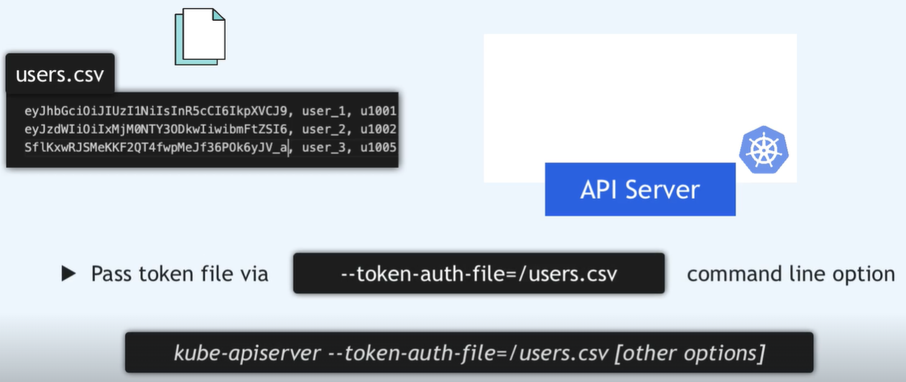
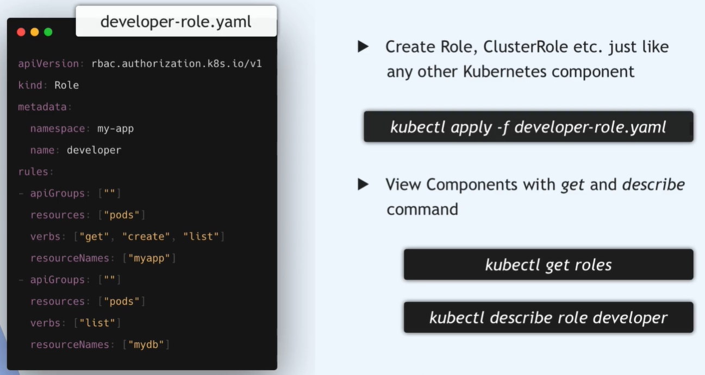
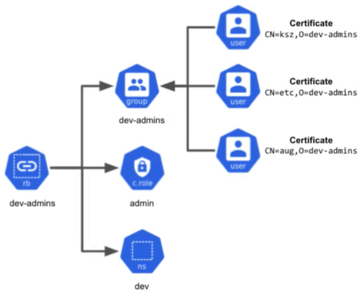

Kubernetes nie ma obiektów, które reprezentują normalne konta użytkowników.<br>
Normalnych użytkowników nie można dodać do klastra za pomocą wywołania API
Uwieżytelnienie za pomocą przedstawienia aktualnego certyfikatu - nazwa użytownika zapisana w podmiocie certyfikatu.

Kubernetes używa certyfikatów klienta, tokenów nośnika lub uwierzytelniającego serwera proxy do uwierzytelniania żądań API za pośrednictwem wtyczek uwierzytelniających

Integracje się z innymi protokołami uwierzytelniania (LDAP, SAML, Kerberos, alternatywne schematy x509 itp.), można przeprowadzić za pomocą uwierzytelniającego serwera proxy lub uwierzytelniającego webhooka

Od Kubernetes 1.4 certyfikaty klienta mogą również wskazywać przynależność użytkownika do grupy za pomocą pól organizacji certyfikatu. Aby uwzględnić wiele przynależności użytkownika do grupy, należy uwzględnić wiele pól organizacji w certyfikacie

JWT (Json Web Token) Authenticator to uwierzytelniacz do uwierzytelniania użytkowników Kubernetes przy użyciu zgodnych tokenów JWT. Uwierzytelniacz spróbuje przeanalizować surowy token ID, zweryfikować, czy został podpisany przez skonfigurowanego wystawcę. Klucz publiczny do weryfikacji podpisu jest odkrywany z publicznego punktu końcowego wystawcy przy użyciu odkrycia OIDC.

Kubernetes nie zapewnia dostawcy tożsamości OpenID Connect. Możesz użyć istniejącego publicznego dostawcy tożsamości OpenID Connect (takiego jak Google lub inne ). Możesz też uruchomić własnego dostawcę tożsamości, takiego jak dex , Keycloak , CloudFoundry UAA lub Tremolo Security's OpenUnison .

List Privilege Rule - dajemuy użytkownikom dostęp tylko do tych zasobów, które potrzebują


### RBAC w Kubernetes (Role-Based Access Control)
RBAC (Role-Based Access Control) to mechanizm kontroli dostępu w Kubernetes, który pozwala na precyzyjne definiowanie, kto może wykonywać jakie operacje na zasobach klastra.

RBAC opiera się na czterech głównych zasobach:
- Role – Definiuje uprawnienia dla określonych zasobów w danym namespace (np. get, list, create, delete).
- ClusterRole – Działa tak samo jak Role, ale obowiązuje w całym klastrze. Jeśli chcemy przyznać uprawnienia dla całego klastra.
- RoleBinding – Przypisuje wcześniej zdefiniowaną Role do użytkownika (User), grupy (Group) lub konta serwisowego (ServiceAccount) w danym namespace.
- ClusterRoleBinding – Działa jak RoleBinding, ale w skali całego klastra.

Kubernetes używa zewnętrznych zródeł autentykacji do zarządzaia użytkownikami i grupami, sam się tym nie zajmuje, dostarcza jedynie możliwości tworzenia ról i ich przypisywania odpowiednim grupom, użytkownikom (np integracja z AAD)
Zewnętrznym żródłem może być plik (token, user, uid), certyfikat podpisany przez k8s, LDAP

Jeśli chesz podłaczyć statyczny plik autentykacji do klastra k8s


W przypadku certyfikatu usisz wygenerować go dla kazdedgo użytkownika, grupy

W rzypadku LDAP - patrz dokumentacja ks8 i AAD

### ServiceAccount
Service Account (SA) to specjalny typ konta używany przez aplikacje działające w klastrze Kubernetes do uwierzytelniania i autoryzacji, jest to tożsamość dla aplikacji działających w k8s.
Jest to reprezentacja konta użytkownika dla aplikacji.



RBAC Model


ABAC (Attribute-Based Access Control) to starsza metoda kontroli dostępu w Kubernetes, w której uprawnienia są przyznawane na podstawie atrybutów użytkownika i zasobu. Opiera sie na JSON z regułami dostępu.

Kubernetes wykorzystuje webhooki do dynamicznej kontroli zdarzeń, np.:
- Admission Webhooks – sprawdzanie i modyfikowanie zasobów przed ich zapisaniem w klastrze.
- Authentication Webhooks – uwierzytelnianie użytkowników przez zewnętrzne systemy (np. AAD).
- Event Webhooks – wysyłanie powiadomień o zdarzeniach w klastrze.

Przejdź do lokalizacji ```/etc/kubernetes/manifests/kube-apiserver.yaml```  sprawdź czy właczony jest tryb autoryzacji RBAC
```--authorization-mode=RBAC```
```--enable-admission-plugins=NodeRestriction``` (włączone webhooki).

Można tu zmieniać autoryzację, autentykację, certyfikaty, integrację z chmurą itp.
Definiuje sposób działania kube-apiservera, który jest głównym interfejsem klastra.
Każda zmiana wymaga restartu kubelet, który automatycznie uruchomi nową wersję Poda.
