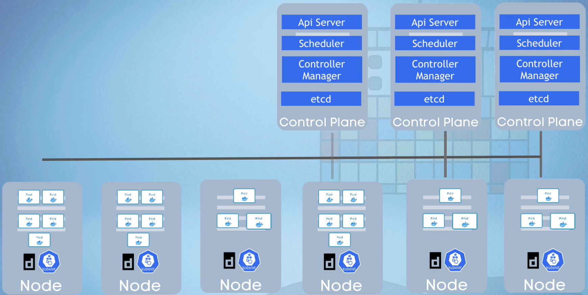
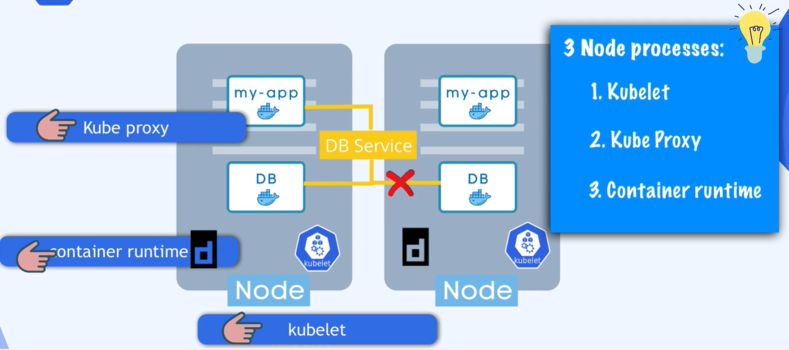

Istnieje dwa rodzaje nodów.
Master node i Worker node. Kazdy z nich pełni inna funkcje w klastrze

## Worker node

Na każdym nodzie może istnieć wiele podów.
Na każdym nodzie muszą być zainstalowane trzy procesy:

1. container runtime -  uruchamia kontenery, (api,sched,c-m,etcd to też kontenery), może to by: docer / container_d / crio-o
Docker runtime jest pierwszym Container Runtime który posiadanie kodu do komunikacji z dockr bezpośrednio w kodzie kubeleta

2. kubelet - odpowiada za pobranie konfiguracji i właściwa prace noda i podów (z kontynerem wew). Przypisuje zasoby noda do kontenera (cpu/ram/storage)
rozmowy z docketem w celu zaplanowania kontenerów

3. kube proxy - odpowiedzialny za komunikację (LB-service-pod). odpowiedzialny za przekazywanie zapytań z komponentu Service do poda

