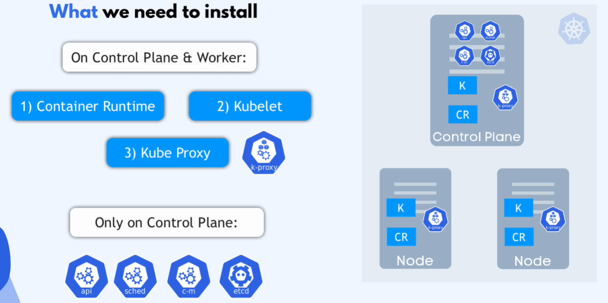
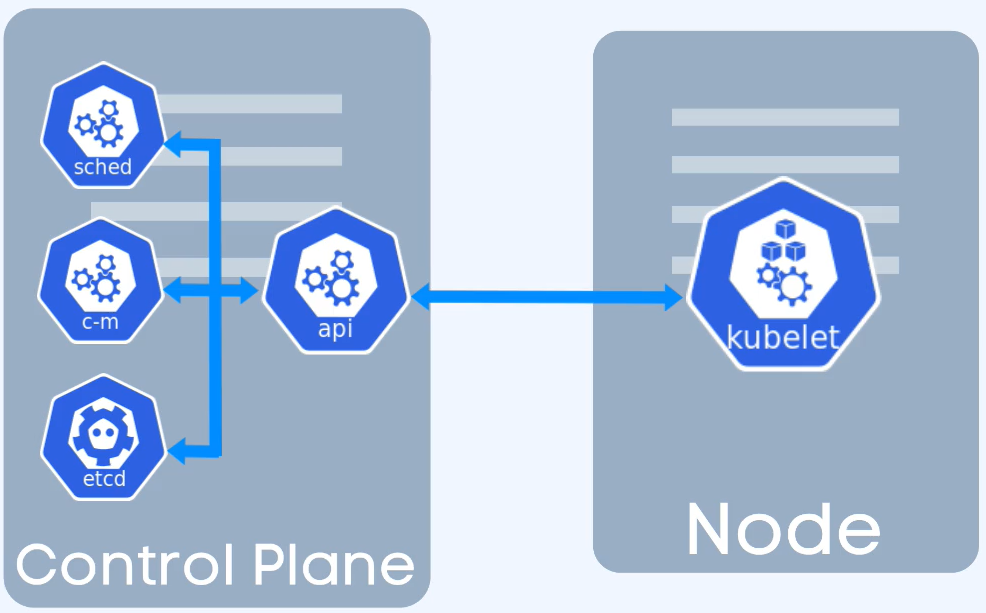
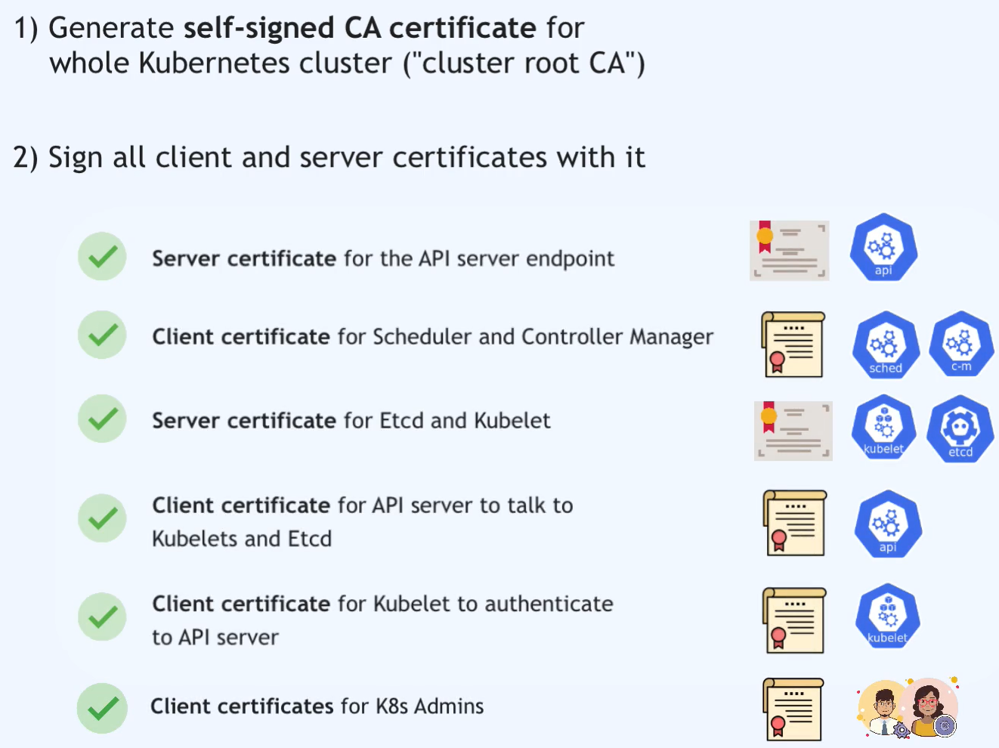

# Certyfikat

## TLS certificates

Jest jedyną droga umożliwiającą zaufaną, bezpieczną komuikację między klientem i serverem lub użytkownikiem i aplikacją
umiemożliwia odczytanie danych przesyłanych w trakcie komunikacji, np user, password

### Symetric encryption

Ten sam klucz używany jest do zaszyfrowania transakci jak i do jek odszyfrowania
Nie jest bezpiezny, nie 

### Asemetric encryption

Transakcjs od strony klienta szyfrowana jest kluczem publicznym i wysyłana na serwer,  który może odszyfrować te tane za pomoca klucza prywatnego.
Klucz prywatny nie jest współdzielony, pozostaje na serwerze i jest tylko przez niego uzywany.

### Cert Authority

Klucz publiczny zaszyty jest w certyfikacie wydawanym przez zaufany urząd certyfikacji. Klient zobowiązany jest sprawdzić czy wchodz na włściwa stronę i spr. czy strona posiada aktualny cert wydany przez zaufany urząd certyfikacji (CA).
Certyfikat wydawany jest na nazwę domenowa (nigdy na adres ip i nie moze być użyty w innej domenie).
Lista zaufanych dostawców certyfikatów jest dostępna online.

## Budowa klastra k8s

Klaster będzie budowany na AWS z użyciem instancji.
Mimo, Iz AWS umożliwia tworzene klastra k8s na EKS, który jest dedykowanym nażędziem do tego celu, to jednak tworzenie klastra k8s w oparciu o EC2 daje wieksze możliwości dla administratora i do samej nauki kubernetes.

Mając na uwadze dokumentacjie kuberentes dotyczącea minuimalnych wymagań nodów https://kubernetes.io/docs/setup/production-environment/tools/kubeadm/install-kubeadm/



kubelet przegląda katalog na nodzie na którym jest uruchomiony

```bash
/etc/kubernetes/manifest/
```

w poszukiwaniu plików manifestu api/sched/c-m/etcd
jeśli znajdzie plik w tej lokalizacji to znaczy że jest to **static pod** - master node

Połaczenie pomiędyz komponentami k8s musi być bezpeiczne.
Wszystkie komponenty musze posiadac certyfikat, dla tego na samym początku musisz wygenerować self-singe CA certyficate dla k8s (cluster root CA).
Certyfikaty zostaną one przypisane wszystkim kompnentom klastra.

certyfikaty przechowywane sa w katakogu 

```bash
/etc/kubernetes/pki/
```



API Server - posiada certygikat servera (klucz publiczny) dla możliwości rozmowy z scheduler i controler manager oraz certyfikat klienta dla możliwości rozmowy z etcd i kubelet.

Scheduler i Controler manager - posiada certyfikat klienta (klucz publiczny)

ETCD i kubele - posiadają własne certyfikaty servera

kublet - posiada również certyfikat klienta bo musi rozmawiać z api server
dodatkowo jako administrator potrzebujesz certyfikatu klienta aby móc rozmawiać z api server klastra.

Oczywiści wszystkie te certyfikaty muszą być wystawione przez ten sam CA inaczej komponenty nie będą w stanie ze sobą rozmawiać.



Przygotowanie manifestu dla klastra oraz odpowiednich certyfikatow jest bardzo czasochłonne.
Rozwiazaneim tego problemu jest narzędzie **kubeadm** 

odwiedź stronę [k8s-kubeadm](https://kubernetes.io/docs/setup/production-environment/tools/kubeadm/)

kubeadm pomaga w szybkiej konfiguracji węzłów (node) oraz tworzeniu klastra Kubernetes, ułatwiając administrację i utrzymanie systemu.

Główne funkcje kubeadm obejmują:

1. Inicjalizacja klastra: kubeadm pozwala na inicjalizację nowego klastra Kubernetes. Tworzy ono niezbędne składniki, takie jak API Server, Controller Manager, Scheduler, CoreDNS itp.

2. Dodawanie węzłów (node): Umożliwia dodawanie nowych węzłów (node) do klastra, umożliwiając skalowanie.

3. Konfiguracja sieci: Pomaga w konfiguracji sieci w klastrze, zazwyczaj poprzez dostarczenie specyficznego rozwiązania sieciowego (np. Flannel, Calico, itp.).

4. Upraszczona konfiguracja: Dostarcza prosty interfejs i komendy do konfigurowania różnych aspektów klastra, takich jak autoryzacja, uwierzytelnianie, monitorowanie, itp.

5. Integracja z Cloud Providerami: Posiada integracje z różnymi dostawcami chmury, ułatwiając konfigurację klastra w środowiskach chmurowych.

6. Wsparcie dla HA (High Availability): Umożliwia konfigurację klastra Kubernetes w trybie wysokiej dostępności (HA), zapewniając większą niezawodność.
