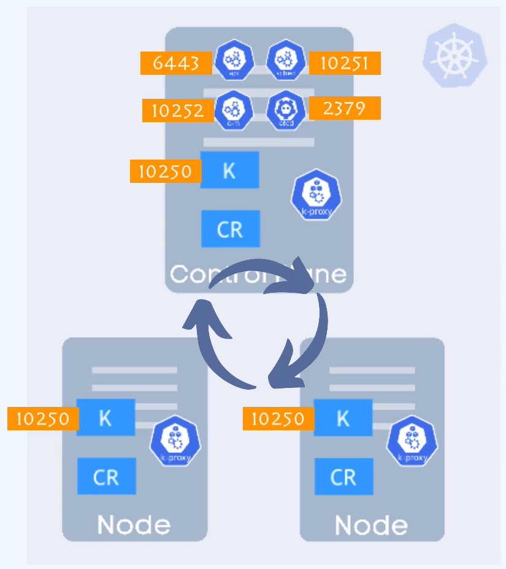
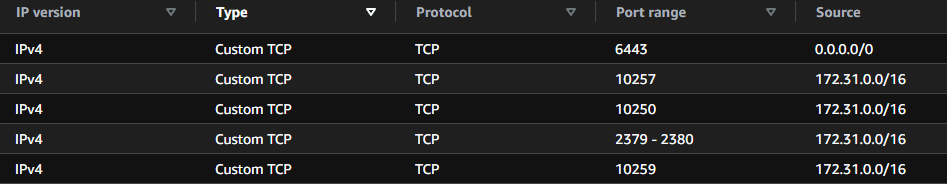
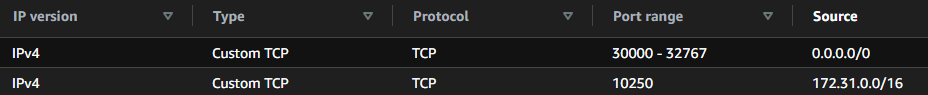
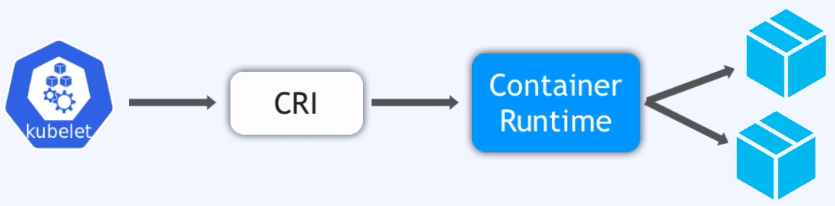

Postępuj zgodnie z dokumentacją [kubeadm](https://kubernetes.io/docs/setup/production-environment/tools/kubeadm/install-kubeadm/)


1. Otwórz porty na poziomie security group [required ports](https://kubernetes.io/docs/reference/networking/ports-and-protocols/)
   osobna lista portów dla mastera, osobna dla workera.
   


k8s-master-SG


k8s-worker-SG


2. utwórz nody mastera oraz workera (pamiętaj o minimalnych wymaganiach nodow klastra k8s).

---Master
1x t3.medium
---Worker
2x t3.medium

3. wyłacz swap (dotyczy mastera i workera)

```bash
sudo swapoff -a
```
4. podepnij odpowiednie security groupy do nodów

5. nazwij nody, odpowienio

```bash
sudo hostnamectl set-hostname "master/worker"
exec bash
```

6. Dotyczy mastera i workerów (spełnia walory estetyczne, bprzejżyste zarządzanie klasterm).
Można pominąć ten krok używająć domyślnych nazw systemu. (hostname ip-10-20-10-56)
Fakt, iż k8s używa cetyfikatów do komunikacji, muszą być wykożystywane nazwy a nie aderesy ip nodów.

```bash
echo "10.20.10.56 master" >> /etc/hosts
echo "10.20.10.129 worker1" >> /etc/hosts
echo "10.20.10.182 worker2" >> /etc/hosts
```

7. zainstaluj Container Runtime
Nie jest komponentem k8s. ContainerRuntime jest osobna aplikacja, którą k8s uzywa do planowania kontenerów.
CRI - Container Runtime Interface, to zestaw ról jak container runtime musi zaimplementować. 
sprawdź [container runtime](../01-core-concepts/02-architecture/01-worker_.md)
Za pomoca interwejsu kubelet jest w stanie rozmawiać s conteiner runtime aby zaplanować kontenery, pobrać obrazy, ...



Docker nie implementuje ról CRI
k8s dodał poziom dockershim (GW), aby wspierać Docker.
dockershim umożliwia kublet rozmowe z docker, używając API CRI i jest częścią kodu k8s.


k8s nie wspiera już Docker runtime (od wersji 1.22)
dla tego inne kontenery stały się bardziej popularne (cri-o, containerD)

Docker był peirwszym, najbardziej popularnym środowiskiem uruchamiania kontenerów.
jest uzywany do budowy obrazów Docker

obecnie containerD jest czołowym środowiskiem uruchamiania kontenerów.

przejd do strony [Container Runtime](https://kubernetes.io/docs/setup/production-environment/container-runtimes/)


8. utwurz plik konfiguracyjny dka kubernetes (wykonaj dla mastera i workera)
jest to konfiguracja sieci dla interfejsu środowiska uruchomieniowego kontenera.
ide jest to aby wsszystki nody k8s mogły łączyć się ze sobą

```bash
cat <<EOF | sudo tee /etc/modules-load.d/k8s.conf
overlay
br_netfilter
EOF

sudo modprobe overlay
sudo modprobe br_netfilter

# sysctl params required by setup, params persist across reboots
cat <<EOF | sudo tee /etc/sysctl.d/k8s.conf
net.bridge.bridge-nf-call-iptables  = 1
net.bridge.bridge-nf-call-ip6tables = 1
net.ipv4.ip_forward                 = 1
EOF

# Apply sysctl params without reboot
sudo sysctl --system
```
9. instalacja containerD
przejdź do strony [ContainerD]https://github.com/containerd/containerd/blob/main/docs/getting-started.md
ConatainerD nie jest procesem kubernetsa, jest zewnetrznym procesem należącym do Dokera

na stronie przejdź do opcji 2 (zostaniesz przeniesiony dos trony docker)

```bash
sudo apt update
sudo apt install containerd
```
 wróc do strony [ContainerD]https://github.com/containerd/containerd/blob/main/docs/getting-started.md
 przejdź do sekcji Advanced topics

 /etc/containerd/confg.toml - containerd plik konfiguracyjny (procesów?)

 ```bash
 sudo mkdir /etc/containerd
 containerd config default |sudo tee /etc/containerd/config.toml
 ```

 wróć do dokumentacji k8s
 odszukaj sekcji Config the systemd cgroup drive
```bash
 sudo nano /etc/containerd/config.toml
```

odszukaj sekcję containerd.runtimes.runc.option, zmień wartość na true 

```C
  [plugins."io.containerd.grpc.v1.cri".containerd.runtimes.runc.options]
    SystemdCgroup = true
```
użyj skryptu aby zainstalować containerD pomijajac kroki powużej 
[install-containerd.sh](../02-build-cluster/install-containerd.sh)
skrypt rozwiązuje wszystkie problemy od pkt.8

